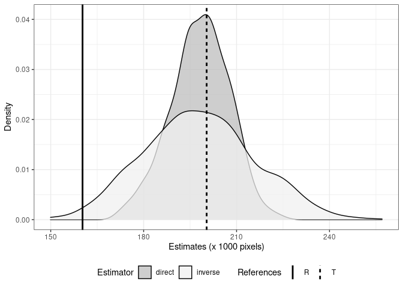
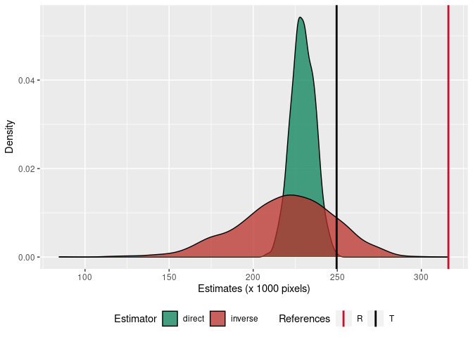
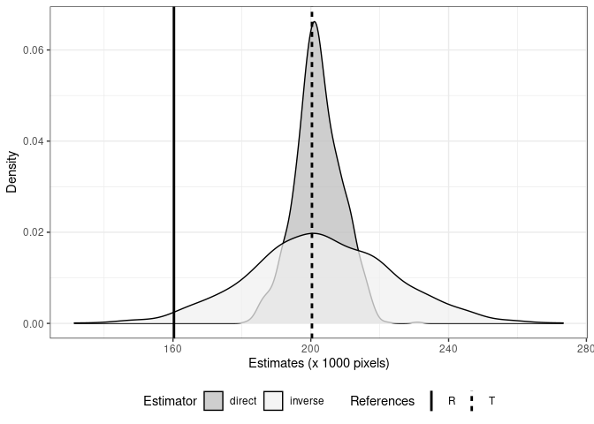
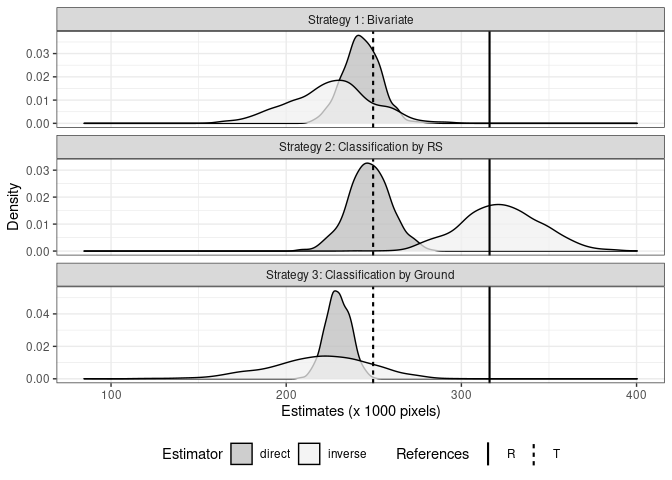
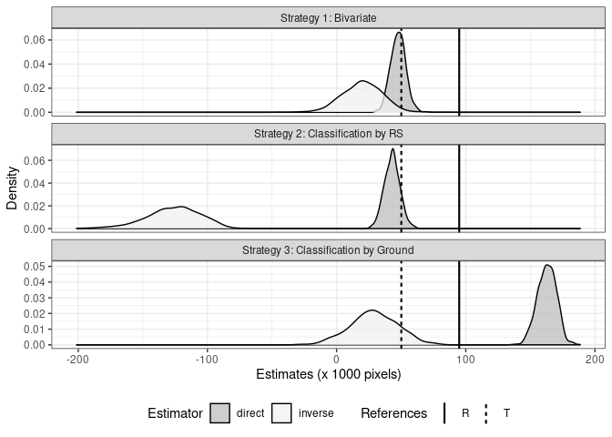
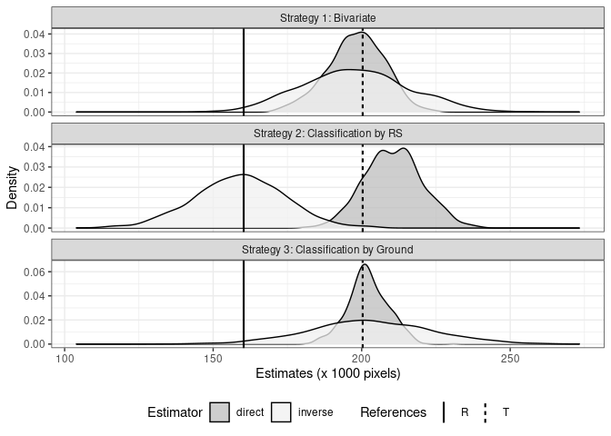
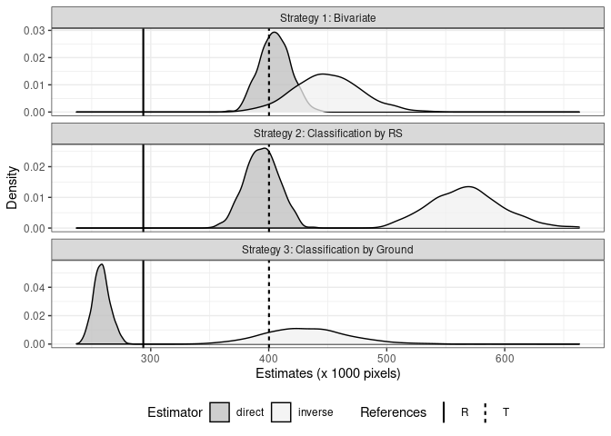
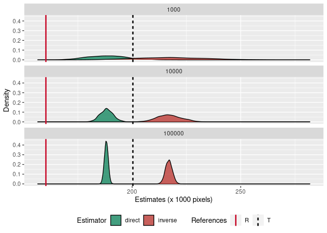

Bootstrap Assessment of Crop Area Estimates using Satellite Pixels
Counting
================
André Leite, Cristiano Ferraz, Jacques Delincé & Raydonal Ospina
</br></br>2022-04-15

## Packages

``` r
library(pracma)
library(tidyverse)
library(readxl)
library(glmnet)
library(knitr)
library(kableExtra)
library(plotly)
library(paletteer)
```

## Function to generate artificial population

``` r
gen_U_star <- function(a_matrix, size, strategy){
  stopifnot(strategy %in% c('one', 'two', 'three'))
  if (strategy == 'one') {
    U_star <- 
    expand_grid(
      c = colnames(a_matrix), 
      g = rownames(a_matrix)) %>% 
    mutate(n = c(a_matrix), 
           pi = n/sum(n), 
           Code = paste0(c, ' - ', g)) %>% 
    sample_n(size = size, replace = TRUE, weight = pi) %>% 
    select(g, c, pi)
  } else if (strategy == 'two') {
    sample_size_group <- size/nrow(a_matrix)
    U_star <-
      a_matrix %>% 
      as_tibble(rownames = 'g') %>% 
      pivot_longer(-g, names_to = 'c', values_to = 'n') %>% 
      group_by(c) %>% 
      mutate(pi = n/sum(n)) %>% 
      group_split() %>% 
      map_dfr( ~ sample_n(.x, size = sample_size_group, replace = TRUE, weight = pi))  %>% 
      select(g, c, pi)
  } else if (strategy == 'three') {
    sample_size_group <- size/ncol(a_matrix)
    U_star <-
      a_matrix %>% 
      as_tibble(rownames = 'g') %>% 
      pivot_longer(-g, names_to = 'c', values_to = 'n') %>% 
      group_by(g) %>% 
      mutate(pi = n/sum(n)) %>% 
      group_split() %>% 
      map_dfr( ~ sample_n(.x, size = sample_size_group, replace = TRUE, weight = pi)) %>% 
      select(g, c, pi)
  }
  return(U_star)
}
```

## Function to get a sample from artificial population

``` r
# get_a_sample <- function(U_star, N_0, strategy, order){
#   a_sample <- U_star %>% 
#     sample_n(N_0) %>% 
#     count(c, g) %>% 
#     pivot_wider(names_from = 'c', values_from = n, values_fill = 0) %>% 
#     column_to_rownames(var = 'g') %>% 
#     as.matrix()  
#   if (is.null(order)) return(a_sample)
#   else return(a_sample[order, order])
# }

### Three strategies function

get_a_sample_3st <- function(U_star, N_0, strategy = 'one', order){
  stopifnot(strategy %in% c('one', 'two', 'three'))
  if (strategy == 'one') {
    a_sample <- U_star %>% 
      sample_n(N_0) %>% 
      count(c, g) %>% 
      pivot_wider(names_from = 'c', values_from = n, values_fill = 0) %>% 
      arrange(match(g, order)) %>% 
      select(crop = g, all_of(order)) %>% 
      column_to_rownames(var = 'crop') %>% 
      as.matrix() 
  } else if (strategy == 'two') {
    sample_size_group <- N_0/nrow(a_0)
    a_sample <- 
      U_star %>% 
      count(g, c) %>% 
      group_by(c) %>% 
      select(c, g, n) %>% 
      mutate(pi = n/sum(n)) %>% 
      group_split() %>% 
      map_dfr( ~ sample_n(.x, size = sample_size_group, replace = TRUE, weight = pi)) %>% 
      count(g, c) %>% 
      pivot_wider(names_from = "c", values_from = "n", values_fill = 0) %>% 
      arrange(match(g, order)) %>% 
      select(crop = g, all_of(order)) %>% 
      column_to_rownames(var = 'crop') %>% 
      as.matrix()
  } else if (strategy == 'three') {
    sample_size_group <- N_0/ncol(a_0)
    a_sample <- 
      U_star %>% 
      count(g, c) %>% 
      group_by(g) %>% 
      select(g, c, n) %>% 
      mutate(pi = n/sum(n)) %>% 
      group_split() %>% 
      map_dfr( ~ sample_n(.x, size =  sample_size_group, replace = TRUE, weight = pi)) %>% 
      count(g, c) %>% 
      pivot_wider(names_from = "c", values_from = "n", values_fill = 0) %>% 
      arrange(match(g, order)) %>% 
      select(crop = g, all_of(order)) %>% 
      column_to_rownames(var = 'crop') %>% 
      as.matrix()
  }
  return(a_sample)
}
```

## Function to get estimates from sample confution matrix and artificial population

``` r
get_estimates <- function(a_matrix, R_U_0){
  e_g_dado_c <- a_matrix %*% solve(diag(colSums(a_matrix)))
  e_c_dado_g <- t(a_matrix) %*% solve(diag(rowSums(a_matrix)))
  inverse_e_c_dado_g <- solve(e_c_dado_g)
  rownames(inverse_e_c_dado_g) <- rownames(e_c_dado_g)
  
  direct <- (e_g_dado_c %*% R_U_0) %>% 
    as_tibble(rownames = 'crop') %>% 
    mutate(estimator = 'direct')
  
  inverse <- (inverse_e_c_dado_g %*% R_U_0) %>%
    as_tibble(rownames = 'crop') %>% 
    mutate(estimator = 'inverse') 
  
  return(bind_rows(direct, inverse))
}
```

## Function to get bootstrap replicas

``` r
get_bootstrap <- function(B, U_star, N_0, R_U_0, strategy, order) {
  1:B %>% 
    map(~ get_a_sample_3st(U_star, N_0, strategy, order)) %>% 
    map_dfr(~ get_estimates(.x, R_U_0)) %>% 
    mutate(replica = ceiling(row_number()/6))
}
```

## Simulated data

``` r
jacques_tibble <- read_excel("data/Simdata.xlsx", 
                      sheet = "Sheet1", 
                      range = "B3:G8",
                      .name_repair = ~ if_else(.x == '', 'crop', .x))


jacques_matrix <- jacques_tibble %>% 
  column_to_rownames(var = "crop") %>% 
  as.matrix() 
```

``` r
jacques_matrix %>% 
  as.data.frame() %>% 
  rownames_to_column(var = "crop") %>% 
  kable(caption = "Jacques' matrix") %>% 
  kable_styling(bootstrap_options = 
                  c("striped", "hover", "condensed", "responsive"), 
                full_width = FALSE, font_size = 12) %>% 
  column_spec(1, bold = TRUE)
```

<table class="table table-striped table-hover table-condensed table-responsive" style="font-size: 12px; width: auto !important; margin-left: auto; margin-right: auto;">
<caption style="font-size: initial !important;">
Jacques’ matrix
</caption>
<thead>
<tr>
<th style="text-align:left;">
crop
</th>
<th style="text-align:right;">
Wheat
</th>
<th style="text-align:right;">
Rapeseed
</th>
<th style="text-align:right;">
Corn
</th>
<th style="text-align:right;">
Sugarbeet
</th>
<th style="text-align:right;">
Others
</th>
</tr>
</thead>
<tbody>
<tr>
<td style="text-align:left;font-weight: bold;">
Wheat
</td>
<td style="text-align:right;">
0.200
</td>
<td style="text-align:right;">
0.020
</td>
<td style="text-align:right;">
0.005
</td>
<td style="text-align:right;">
0.005
</td>
<td style="text-align:right;">
0.020
</td>
</tr>
<tr>
<td style="text-align:left;font-weight: bold;">
Rapeseed
</td>
<td style="text-align:right;">
0.010
</td>
<td style="text-align:right;">
0.030
</td>
<td style="text-align:right;">
0.000
</td>
<td style="text-align:right;">
0.000
</td>
<td style="text-align:right;">
0.010
</td>
</tr>
<tr>
<td style="text-align:left;font-weight: bold;">
Corn
</td>
<td style="text-align:right;">
0.001
</td>
<td style="text-align:right;">
0.010
</td>
<td style="text-align:right;">
0.080
</td>
<td style="text-align:right;">
0.005
</td>
<td style="text-align:right;">
0.004
</td>
</tr>
<tr>
<td style="text-align:left;font-weight: bold;">
Sugarbeet
</td>
<td style="text-align:right;">
0.005
</td>
<td style="text-align:right;">
0.015
</td>
<td style="text-align:right;">
0.040
</td>
<td style="text-align:right;">
0.120
</td>
<td style="text-align:right;">
0.020
</td>
</tr>
<tr>
<td style="text-align:left;font-weight: bold;">
Others
</td>
<td style="text-align:right;">
0.100
</td>
<td style="text-align:right;">
0.020
</td>
<td style="text-align:right;">
0.010
</td>
<td style="text-align:right;">
0.030
</td>
<td style="text-align:right;">
0.240
</td>
</tr>
</tbody>
</table>

###  and  vectors

``` r
Size <- 1e6
R_vector <- jacques_matrix %>% 
  { matrix(colSums(.), ncol = 1, dimnames = list(colnames(.), 'value')) * Size } %>%
  t() 
T_vector <- jacques_matrix %>% 
  { matrix(rowSums(.), ncol = 1, dimnames = list(colnames(.), 'value')) * Size } 
```

### Get a artificial population and associated R vector

``` r
# Population Size
Size = 1000000
# Seed
set.seed(112358)

U_0 <- gen_U_star(jacques_matrix, strategy = 'one', size = Size)
R_U_0 <- U_0 %>% 
  count(c) %>% 
  arrange(match(c, colnames(jacques_matrix))) %>% 
  column_to_rownames(var = 'c') %>% 
  as.matrix() 

T_U_0 <- U_0 %>% 
  count(g) %>% 
  arrange(match(g, colnames(jacques_matrix))) %>% 
  column_to_rownames(var = 'g') %>% 
  as.matrix() 

Reference <- 
  bind_rows(
    T_U_0 %>% as_tibble(rownames = "crop") %>% mutate(References = "T"),
    R_U_0 %>% as_tibble(rownames = "crop") %>% mutate(References = "R")
  ) %>% 
  mutate(crop = factor(crop, levels = colnames(jacques_matrix), ordered = TRUE))

# a_0 <- U_0 %>% 
#   sample_n(N_0) %>% 
#   count(g, c) %>%   
#   pivot_wider(names_from = "c", values_from = "n",values_fill = 0) %>% 
#   arrange(match(g, colnames(jacques_matrix))) %>% 
#   select(crop = g, all_of(colnames(jacques_matrix))) %>% 
#   column_to_rownames(var = 'crop') %>% 
#   as.matrix() 
```

### T_0 and R_0 tables

``` r
T_U_0 %>% 
  kable(caption = "T_0 vector") %>% 
  kable_styling(bootstrap_options = 
                  c("striped", "hover", "condensed", "responsive"), 
                full_width = FALSE, font_size = 12) 
```

<table class="table table-striped table-hover table-condensed table-responsive" style="font-size: 12px; width: auto !important; margin-left: auto; margin-right: auto;">
<caption style="font-size: initial !important;">
T_0 vector
</caption>
<thead>
<tr>
<th style="text-align:left;">
</th>
<th style="text-align:right;">
n
</th>
</tr>
</thead>
<tbody>
<tr>
<td style="text-align:left;">
Wheat
</td>
<td style="text-align:right;">
249615
</td>
</tr>
<tr>
<td style="text-align:left;">
Rapeseed
</td>
<td style="text-align:right;">
50086
</td>
</tr>
<tr>
<td style="text-align:left;">
Corn
</td>
<td style="text-align:right;">
99736
</td>
</tr>
<tr>
<td style="text-align:left;">
Sugarbeet
</td>
<td style="text-align:right;">
200341
</td>
</tr>
<tr>
<td style="text-align:left;">
Others
</td>
<td style="text-align:right;">
400222
</td>
</tr>
</tbody>
</table>

``` r
R_U_0 %>% 
  kable(caption = "R_0 vector") %>% 
  kable_styling(bootstrap_options = 
                  c("striped", "hover", "condensed", "responsive"), 
                full_width = FALSE, font_size = 12) 
```

<table class="table table-striped table-hover table-condensed table-responsive" style="font-size: 12px; width: auto !important; margin-left: auto; margin-right: auto;">
<caption style="font-size: initial !important;">
R_0 vector
</caption>
<thead>
<tr>
<th style="text-align:left;">
</th>
<th style="text-align:right;">
n
</th>
</tr>
</thead>
<tbody>
<tr>
<td style="text-align:left;">
Wheat
</td>
<td style="text-align:right;">
316083
</td>
</tr>
<tr>
<td style="text-align:left;">
Rapeseed
</td>
<td style="text-align:right;">
94924
</td>
</tr>
<tr>
<td style="text-align:left;">
Corn
</td>
<td style="text-align:right;">
135024
</td>
</tr>
<tr>
<td style="text-align:left;">
Sugarbeet
</td>
<td style="text-align:right;">
160274
</td>
</tr>
<tr>
<td style="text-align:left;">
Others
</td>
<td style="text-align:right;">
293695
</td>
</tr>
</tbody>
</table>

## Strategy 1: Bivariate

### a_0, r_0, t_0

``` r
## Sample
N_0 <- 1000
a_0 <- get_a_sample_3st(U_star = U_0, N_0 = 1000, order = colnames(jacques_matrix), strategy = "one")

r_vector <- a_0 %>% 
  { matrix(colSums(.), ncol = 1, dimnames = list(colnames(.), 'value'))} %>%
  t() 
t_vector <- a_0 %>% 
  { matrix(rowSums(.), ncol = 1, dimnames = list(colnames(.), 'value'))} 

a_0 %>% as_tibble(rownames = 'crop') %>% 
  bind_rows(as_tibble(r_vector) %>% mutate(crop = 'R')) %>% 
  bind_cols(as_tibble(t_vector) %>% rename(T = value) %>% 
              bind_rows(tibble(`T` = 1000))) %>% 
  kable(caption = "a_0 confusion sample matrix") %>% 
  kable_styling(bootstrap_options = 
                  c("striped", "hover", "condensed", "responsive"), 
                full_width = FALSE, font_size = 12) %>% 
  column_spec(c(1,7), bold = TRUE) %>% 
  row_spec(6, bold = TRUE)
```

<table class="table table-striped table-hover table-condensed table-responsive" style="font-size: 12px; width: auto !important; margin-left: auto; margin-right: auto;">
<caption style="font-size: initial !important;">
a_0 confusion sample matrix
</caption>
<thead>
<tr>
<th style="text-align:left;">
crop
</th>
<th style="text-align:right;">
Wheat
</th>
<th style="text-align:right;">
Rapeseed
</th>
<th style="text-align:right;">
Corn
</th>
<th style="text-align:right;">
Sugarbeet
</th>
<th style="text-align:right;">
Others
</th>
<th style="text-align:right;">
T
</th>
</tr>
</thead>
<tbody>
<tr>
<td style="text-align:left;font-weight: bold;">
Wheat
</td>
<td style="text-align:right;">
201
</td>
<td style="text-align:right;">
23
</td>
<td style="text-align:right;">
6
</td>
<td style="text-align:right;">
3
</td>
<td style="text-align:right;">
19
</td>
<td style="text-align:right;font-weight: bold;">
252
</td>
</tr>
<tr>
<td style="text-align:left;font-weight: bold;">
Rapeseed
</td>
<td style="text-align:right;">
11
</td>
<td style="text-align:right;">
36
</td>
<td style="text-align:right;">
0
</td>
<td style="text-align:right;">
0
</td>
<td style="text-align:right;">
7
</td>
<td style="text-align:right;font-weight: bold;">
54
</td>
</tr>
<tr>
<td style="text-align:left;font-weight: bold;">
Corn
</td>
<td style="text-align:right;">
4
</td>
<td style="text-align:right;">
8
</td>
<td style="text-align:right;">
82
</td>
<td style="text-align:right;">
6
</td>
<td style="text-align:right;">
5
</td>
<td style="text-align:right;font-weight: bold;">
105
</td>
</tr>
<tr>
<td style="text-align:left;font-weight: bold;">
Sugarbeet
</td>
<td style="text-align:right;">
4
</td>
<td style="text-align:right;">
17
</td>
<td style="text-align:right;">
38
</td>
<td style="text-align:right;">
117
</td>
<td style="text-align:right;">
19
</td>
<td style="text-align:right;font-weight: bold;">
195
</td>
</tr>
<tr>
<td style="text-align:left;font-weight: bold;">
Others
</td>
<td style="text-align:right;">
108
</td>
<td style="text-align:right;">
31
</td>
<td style="text-align:right;">
7
</td>
<td style="text-align:right;">
29
</td>
<td style="text-align:right;">
219
</td>
<td style="text-align:right;font-weight: bold;">
394
</td>
</tr>
<tr>
<td style="text-align:left;font-weight: bold;font-weight: bold;">
R
</td>
<td style="text-align:right;font-weight: bold;">
328
</td>
<td style="text-align:right;font-weight: bold;">
115
</td>
<td style="text-align:right;font-weight: bold;">
133
</td>
<td style="text-align:right;font-weight: bold;">
155
</td>
<td style="text-align:right;font-weight: bold;">
269
</td>
<td style="text-align:right;font-weight: bold;font-weight: bold;">
1000
</td>
</tr>
</tbody>
</table>

### Get a artificial population for bootstrap sampling

``` r
U_star <- gen_U_star(a_0, strategy = 'one', size = Size)
```

### Generate 1000 bootstrap replicas

``` r
#set.seed(112358)
result_one <- get_bootstrap(1000, U_star, N_0, R_U_0, strategy = 'one', order = colnames(jacques_matrix)) %>% 
  mutate(Sample = '1000')
write_rds(result_one, "data/result_one_N1m.rds")
```

### Plot result

``` r
Palette <- palettes_d_names %>%
  filter(length == 3) %>%
  mutate(code = paste0(package, "::", palette)) %>%
  pull(code) %>%
  .[7] #3 5


result_one %>% 
  filter(Sample == "1000") %>% 
  mutate(crop = factor(crop, levels = colnames(jacques_matrix), ordered = TRUE)) %>% 
  ggplot() +
  geom_density(aes(x = n/1000, fill = estimator), alpha = .75, position = 'identity') + 
  facet_wrap(~ crop, scales = 'free', ncol = 2) +
  theme(legend.position="bottom") + labs(x = 'Estimates (x 1000 pixels)', y  = 'Density', fill = 'Estimator') +
  scale_fill_paletteer_d(`"ggthemes::wsj_red_green"`) + 
  geom_vline(aes(xintercept = n/1000, color = References), size = 1, data = Reference) + 
  scale_color_paletteer_d(Palette)
```

<!-- -->

``` r
result_one %>% 
  filter(Sample == "1000") %>% 
  mutate(crop = factor(crop, levels = colnames(jacques_matrix), ordered = TRUE)) %>% 
  ggplot() +
  theme_bw() +
  geom_density(aes(x = n/1000, fill = estimator), alpha = .75, position = 'identity') + 
  facet_wrap(~ crop, scales = 'free', ncol = 2) +
  theme(legend.position="bottom") + labs(x = 'Estimates (x 1000 pixels)', y  = 'Density', fill = 'Estimator') +
  scale_fill_brewer(palette = "Greys", direction = -1) +
  geom_vline(aes(xintercept = n/1000, linetype = References), size = 1, data = Reference) 
```

<!-- -->

### Bootstrap summary

``` r
table <- result_one %>% group_by(crop, estimator, Sample) %>% 
    summarise(Mean = mean(n), 
              Variance = var(n), 
              `Standard Deviation` = sd(n), 
              CV = `Standard Deviation`/Mean, 
              .groups = 'drop') %>% 
  mutate(crop = factor(crop, levels = colnames(jacques_matrix), ordered = TRUE)) %>% 
  left_join(Reference %>% pivot_wider(names_from = References,  values_from = "n"), by = "crop") %>% 
  mutate(`T Bias` = `T` - Mean,
         `R Bias` = `R` - Mean) %>% 
  rename(Crop = crop, Estimator = estimator) %>% 
  mutate(Mean = format(round(Mean), nsmall = 0, big.mark = ","),
         Variance = format(round(Variance), nsmall = 0, big.mark = ","),
         `Standard Deviation` = format(round(`Standard Deviation`), nsmall = 0, big.mark = ","),
         CV = format(round(CV, 4), nsmall = 2, big.mark = ","), 
         `T` = format(round(`T`), nsmall = 0, big.mark = ","),
         `T Bias` = format(round(`T Bias`), nsmall = 0, big.mark = ","),
         `R` = format(round(`R`), nsmall = 0, big.mark = ","),
         `R Bias` = format(round(`R Bias`), nsmall = 0, big.mark = ","))
table %>% 
  kable(caption = "Direct and Inverse Estimators Bootstrap Results (1000 rounds)", align = "lcrrrr") %>%
  kable_styling(bootstrap_options = c("striped", "hover", "condensed", "responsive"),
                full_width = FALSE, font_size = 12) %>% 
  column_spec(1, bold = TRUE) %>% 
  column_spec(10, color = if_else(str_detect(table$`T Bias`, "-"), 'red', 'black')) %>%  
  column_spec(11, color = if_else(str_detect(table$`R Bias`, "-"), 'red', 'black')) 
```

<table class="table table-striped table-hover table-condensed table-responsive" style="font-size: 12px; width: auto !important; margin-left: auto; margin-right: auto;">
<caption style="font-size: initial !important;">
Direct and Inverse Estimators Bootstrap Results (1000 rounds)
</caption>
<thead>
<tr>
<th style="text-align:left;">
Crop
</th>
<th style="text-align:center;">
Estimator
</th>
<th style="text-align:right;">
Sample
</th>
<th style="text-align:right;">
Mean
</th>
<th style="text-align:right;">
Variance
</th>
<th style="text-align:right;">
Standard Deviation
</th>
<th style="text-align:left;">
CV
</th>
<th style="text-align:center;">
T
</th>
<th style="text-align:right;">
R
</th>
<th style="text-align:right;">
T Bias
</th>
<th style="text-align:right;">
R Bias
</th>
</tr>
</thead>
<tbody>
<tr>
<td style="text-align:left;font-weight: bold;">
Corn
</td>
<td style="text-align:center;">
direct
</td>
<td style="text-align:right;">
1000
</td>
<td style="text-align:right;">
105,769
</td>
<td style="text-align:right;">
52,343,046
</td>
<td style="text-align:right;">
7,235
</td>
<td style="text-align:left;">
0.0684
</td>
<td style="text-align:center;">
99,736
</td>
<td style="text-align:right;">
135,024
</td>
<td style="text-align:right;color: red !important;">
-6,033
</td>
<td style="text-align:right;color: black !important;">
29,255
</td>
</tr>
<tr>
<td style="text-align:left;font-weight: bold;">
Corn
</td>
<td style="text-align:center;">
inverse
</td>
<td style="text-align:right;">
1000
</td>
<td style="text-align:right;">
106,371
</td>
<td style="text-align:right;">
155,276,956
</td>
<td style="text-align:right;">
12,461
</td>
<td style="text-align:left;">
0.1171
</td>
<td style="text-align:center;">
99,736
</td>
<td style="text-align:right;">
135,024
</td>
<td style="text-align:right;color: red !important;">
-6,635
</td>
<td style="text-align:right;color: black !important;">
28,653
</td>
</tr>
<tr>
<td style="text-align:left;font-weight: bold;">
Others
</td>
<td style="text-align:center;">
direct
</td>
<td style="text-align:right;">
1000
</td>
<td style="text-align:right;">
405,285
</td>
<td style="text-align:right;">
169,370,330
</td>
<td style="text-align:right;">
13,014
</td>
<td style="text-align:left;">
0.0321
</td>
<td style="text-align:center;">
400,222
</td>
<td style="text-align:right;">
293,695
</td>
<td style="text-align:right;color: red !important;">
-5,063
</td>
<td style="text-align:right;color: red !important;">
-111,590
</td>
</tr>
<tr>
<td style="text-align:left;font-weight: bold;">
Others
</td>
<td style="text-align:center;">
inverse
</td>
<td style="text-align:right;">
1000
</td>
<td style="text-align:right;">
450,186
</td>
<td style="text-align:right;">
789,857,498
</td>
<td style="text-align:right;">
28,104
</td>
<td style="text-align:left;">
0.0624
</td>
<td style="text-align:center;">
400,222
</td>
<td style="text-align:right;">
293,695
</td>
<td style="text-align:right;color: red !important;">
-49,964
</td>
<td style="text-align:right;color: red !important;">
-156,491
</td>
</tr>
<tr>
<td style="text-align:left;font-weight: bold;">
Rapeseed
</td>
<td style="text-align:center;">
direct
</td>
<td style="text-align:right;">
1000
</td>
<td style="text-align:right;">
47,675
</td>
<td style="text-align:right;">
33,723,074
</td>
<td style="text-align:right;">
5,807
</td>
<td style="text-align:left;">
0.1218
</td>
<td style="text-align:center;">
50,086
</td>
<td style="text-align:right;">
94,924
</td>
<td style="text-align:right;color: black !important;">
2,411
</td>
<td style="text-align:right;color: black !important;">
47,249
</td>
</tr>
<tr>
<td style="text-align:left;font-weight: bold;">
Rapeseed
</td>
<td style="text-align:center;">
inverse
</td>
<td style="text-align:right;">
1000
</td>
<td style="text-align:right;">
19,902
</td>
<td style="text-align:right;">
245,375,140
</td>
<td style="text-align:right;">
15,664
</td>
<td style="text-align:left;">
0.7871
</td>
<td style="text-align:center;">
50,086
</td>
<td style="text-align:right;">
94,924
</td>
<td style="text-align:right;color: black !important;">
30,184
</td>
<td style="text-align:right;color: black !important;">
75,022
</td>
</tr>
<tr>
<td style="text-align:left;font-weight: bold;">
Sugarbeet
</td>
<td style="text-align:center;">
direct
</td>
<td style="text-align:right;">
1000
</td>
<td style="text-align:right;">
198,194
</td>
<td style="text-align:right;">
90,921,509
</td>
<td style="text-align:right;">
9,535
</td>
<td style="text-align:left;">
0.0481
</td>
<td style="text-align:center;">
200,341
</td>
<td style="text-align:right;">
160,274
</td>
<td style="text-align:right;color: black !important;">
2,147
</td>
<td style="text-align:right;color: red !important;">
-37,920
</td>
</tr>
<tr>
<td style="text-align:left;font-weight: bold;">
Sugarbeet
</td>
<td style="text-align:center;">
inverse
</td>
<td style="text-align:right;">
1000
</td>
<td style="text-align:right;">
197,975
</td>
<td style="text-align:right;">
315,519,157
</td>
<td style="text-align:right;">
17,763
</td>
<td style="text-align:left;">
0.0897
</td>
<td style="text-align:center;">
200,341
</td>
<td style="text-align:right;">
160,274
</td>
<td style="text-align:right;color: black !important;">
2,366
</td>
<td style="text-align:right;color: red !important;">
-37,701
</td>
</tr>
<tr>
<td style="text-align:left;font-weight: bold;">
Wheat
</td>
<td style="text-align:center;">
direct
</td>
<td style="text-align:right;">
1000
</td>
<td style="text-align:right;">
243,077
</td>
<td style="text-align:right;">
109,212,619
</td>
<td style="text-align:right;">
10,450
</td>
<td style="text-align:left;">
0.0430
</td>
<td style="text-align:center;">
249,615
</td>
<td style="text-align:right;">
316,083
</td>
<td style="text-align:right;color: black !important;">
6,538
</td>
<td style="text-align:right;color: black !important;">
73,006
</td>
</tr>
<tr>
<td style="text-align:left;font-weight: bold;">
Wheat
</td>
<td style="text-align:center;">
inverse
</td>
<td style="text-align:right;">
1000
</td>
<td style="text-align:right;">
225,566
</td>
<td style="text-align:right;">
544,071,760
</td>
<td style="text-align:right;">
23,325
</td>
<td style="text-align:left;">
0.1034
</td>
<td style="text-align:center;">
249,615
</td>
<td style="text-align:right;">
316,083
</td>
<td style="text-align:right;color: black !important;">
24,049
</td>
<td style="text-align:right;color: black !important;">
90,517
</td>
</tr>
</tbody>
</table>

### Other plots

#### Crop: Wheat

``` r
result_one %>% filter(crop == 'Wheat', Sample == '1000') %>% ggplot() +
  geom_density(aes(x = n/1000, fill = estimator), alpha = .75, position = 'identity') + 
  theme(legend.position="bottom") + 
  labs(x = 'Estimates (x 1000 pixels)', y  = 'Density', fill = 'Estimator') +
  scale_fill_paletteer_d(`"ggthemes::wsj_red_green"`) + 
  #ggtitle("Crop: Wheat") +
  geom_vline(aes(xintercept = n/1000, color = References), 
             size = 1, data = Reference %>% filter(crop == 'Wheat')) + 
  scale_color_paletteer_d(Palette)
```

<!-- -->

``` r
result_one %>% 
  filter(crop == 'Wheat', Sample == '1000') %>% 
  ggplot() +
  theme_bw() +
  geom_density(aes(x = n/1000, fill = estimator), alpha = .75, position = 'identity') + 
  theme(legend.position="bottom") + 
  labs(x = 'Estimates (x 1000 pixels)', y  = 'Density', fill = 'Estimator') +
  scale_fill_brewer(palette = "Greys", direction = -1) +
  #ggtitle("Crop: Wheat") +
  geom_vline(aes(xintercept = n/1000, linetype = References), 
             size = 1, data = Reference %>% filter(crop == 'Wheat')) 
```

<!-- -->

#### Crop: Rapeseed

``` r
result_one %>% filter(crop == 'Rapeseed', Sample == '1000') %>% ggplot() +
  geom_density(aes(x = n/1000, fill = estimator), alpha = .75, position = 'identity') + 
  theme(legend.position="bottom") + 
  labs(x = 'Estimates (x 1000 pixels)', y  = 'Density', fill = 'Estimator') +
  scale_fill_paletteer_d(`"ggthemes::wsj_red_green"`) + 
  #ggtitle("Crop: Rapeseed") +
  geom_vline(aes(xintercept = n/1000, color = References), 
             size = 1, data = Reference %>% filter(crop == 'Rapeseed')) + 
  scale_color_paletteer_d(Palette)
```

<!-- -->

``` r
result_one %>% filter(crop == 'Rapeseed', Sample == '1000') %>% ggplot() +
  theme_bw() +
  geom_density(aes(x = n/1000, fill = estimator), alpha = .75, position = 'identity') + 
  theme(legend.position="bottom") + 
  labs(x = 'Estimates (x 1000 pixels)', y  = 'Density', fill = 'Estimator') +
  scale_fill_brewer(palette = "Greys", direction = -1) +
  #ggtitle("Crop: Rapeseed") +
  geom_vline(aes(xintercept = n/1000, linetype = References), 
             size = 1, data = Reference %>% filter(crop == 'Rapeseed')) 
```

<!-- -->

#### Crop: Corn

``` r
result_one %>% filter(crop == 'Corn', Sample == '1000') %>% ggplot() +
  geom_density(aes(x = n/1000, fill = estimator), alpha = .75, position = 'identity') + 
  theme(legend.position="bottom") + 
  labs(x = 'Estimates (x 1000 pixels)', y  = 'Density', fill = 'Estimator') + 
  scale_fill_paletteer_d(`"ggthemes::wsj_red_green"`) + 
  #ggtitle("Crop: Corn") +
  geom_vline(aes(xintercept = n/1000, color = References), 
             size = 1, data = Reference %>% filter(crop == 'Corn')) + 
  scale_color_paletteer_d(Palette)
```

<!-- -->

``` r
result_one %>% filter(crop == 'Corn', Sample == '1000') %>% ggplot() +
  theme_bw() +
  geom_density(aes(x = n/1000, fill = estimator), alpha = .75, position = 'identity') + 
  theme(legend.position="bottom") + 
  labs(x = 'Estimates (x 1000 pixels)', y  = 'Density', fill = 'Estimator') + 
  #ggtitle("Crop: Corn") +
  scale_fill_brewer(palette = "Greys", direction = -1) +
  geom_vline(aes(xintercept = n/1000, linetype = References), 
             size = 1, data = Reference %>% filter(crop == 'Corn')) 
```

<!-- -->

#### Crop: Sugarbeet

``` r
result_one %>% filter(crop == 'Sugarbeet', Sample == '1000') %>% ggplot() +
  geom_density(aes(x = n/1000, fill = estimator), alpha = .75, position = 'identity') + 
  theme(legend.position="bottom") + 
  labs(x = 'Estimates (x 1000 pixels)', y  = 'Density', fill = 'Estimator') + 
  scale_fill_paletteer_d(`"ggthemes::wsj_red_green"`) + 
  #ggtitle("Crop: Sugarbeet") +
  geom_vline(aes(xintercept = n/1000, color = References), 
             size = 1, data = Reference %>% filter(crop == 'Sugarbeet')) + 
  scale_color_paletteer_d(Palette)
```

<!-- -->

``` r
result_one %>% filter(crop == 'Sugarbeet', Sample == '1000') %>% ggplot() +
  theme_bw() +
  geom_density(aes(x = n/1000, fill = estimator), alpha = .75, position = 'identity') + 
  theme(legend.position="bottom") + 
  labs(x = 'Estimates (x 1000 pixels)', y  = 'Density', fill = 'Estimator') + 
  scale_fill_brewer(palette = "Greys", direction = -1) +
  #ggtitle("Crop: Sugarbeet") +
  geom_vline(aes(xintercept = n/1000, linetype = References), 
             size = 1, data = Reference %>% filter(crop == 'Sugarbeet')) 
```

<!-- -->

#### Crop: Others

``` r
result_one %>% filter(crop == 'Others', Sample == '1000') %>% ggplot() +
  geom_density(aes(x = n/1000, fill = estimator), alpha = .75, position = 'identity') + 
  theme(legend.position="bottom") + 
  labs(x = 'Estimates (x 1000 pixels)', y  = 'Density', fill = 'Estimator') + 
  scale_fill_paletteer_d(`"ggthemes::wsj_red_green"`) + 
  #ggtitle("Crop: Others") +
  geom_vline(aes(xintercept = n/1000, color = References), 
             size = 1, data = Reference %>% filter(crop == 'Others')) + 
  scale_color_paletteer_d(Palette)
```

<!-- -->

``` r
result_one %>% filter(crop == 'Others', Sample == '1000') %>% ggplot() +
  theme_bw() +
  geom_density(aes(x = n/1000, fill = estimator), alpha = .75, position = 'identity') + 
  theme(legend.position="bottom") + 
  labs(x = 'Estimates (x 1000 pixels)', y  = 'Density', fill = 'Estimator') + 
  scale_fill_paletteer_d(`"ggthemes::wsj_red_green"`) + 
  #ggtitle("Crop: Others") +
  scale_fill_brewer(palette = "Greys", direction = -1) +
  geom_vline(aes(xintercept = n/1000, linetype = References), 
             size = 1, data = Reference %>% filter(crop == 'Others')) 
```

    ## Scale for 'fill' is already present. Adding another scale for 'fill', which
    ## will replace the existing scale.

<!-- -->

<!-- #### Crop: Wheat -->
<!-- ```{r} -->
<!-- result_one %>% filter(crop == 'Wheat', Sample == '1000') %>% ggplot() + -->
<!--     geom_histogram(aes(x = n/1000, fill = estimator, y=stat(density)), color = 'gray',  -->
<!--                    alpha = .75,  -->
<!--                    bins = 30,  -->
<!--                    position = 'identity') +  -->
<!--     theme(legend.position="bottom") +  -->
<!--     labs(x = 'Estimates (x 1000 pixels)', y  = 'Density', fill = 'Estimator', color = 'Reference') + -->
<!--     scale_fill_paletteer_d(`"ggthemes::wsj_red_green"`) +  -->
<!--     #ggtitle("Crop: Wheat") + -->
<!--     geom_vline(aes(xintercept = n/1000, color = References),  -->
<!--                size = 1, data = Reference %>% filter(crop == 'Wheat')) +  -->
<!--     scale_color_paletteer_d(Palette) -->
<!-- result_one %>% filter(crop == 'Wheat', Sample == '1000') %>% ggplot() + -->
<!--   theme_bw() + -->
<!--     geom_histogram(aes(x = n/1000, fill = estimator, y=stat(density)), color = 'gray',  -->
<!--                    alpha = .75,  -->
<!--                    bins = 30,  -->
<!--                    position = 'identity') +  -->
<!--     theme(legend.position="bottom") +  -->
<!--     labs(x = 'Estimates (x 1000 pixels)', y  = 'Density', fill = 'Estimator', color = 'Reference') + -->
<!--     #ggtitle("Crop: Wheat") + -->
<!--     scale_fill_brewer(palette = "Greys", direction = -1) + -->
<!--     geom_vline(aes(xintercept = n/1000, linetype = References),  -->
<!--                size = 1, data = Reference %>% filter(crop == 'Wheat'))  -->
<!-- ``` -->
<!-- #### Crop: Rapeseed -->
<!-- ```{r} -->
<!-- result_one %>% filter(crop == 'Rapeseed', Sample == '1000') %>% ggplot() + -->
<!--     geom_histogram(aes(x = n/1000, fill = estimator, y=stat(density)), color = 'gray',  -->
<!--                    alpha = .75,  -->
<!--                    bins = 30,  -->
<!--                    position = 'identity') +  -->
<!--     theme(legend.position="bottom") +  -->
<!--     labs(x = 'Estimates (x 1000 pixels)', y  = 'Density', fill = 'Estimator', color = 'Reference') + -->
<!--     scale_fill_paletteer_d(`"ggthemes::wsj_red_green"`) +  -->
<!--     #ggtitle("Crop: Rapeseed") + -->
<!--     geom_vline(aes(xintercept = n/1000, color = References),  -->
<!--                size = 1, data = Reference %>% filter(crop == 'Rapeseed')) +  -->
<!--     scale_color_paletteer_d(Palette) -->
<!-- result_one %>% filter(crop == 'Rapeseed', Sample == '1000') %>% ggplot() + -->
<!--     theme_bw() + -->
<!--     geom_histogram(aes(x = n/1000, fill = estimator, y=stat(density)), color = 'gray',  -->
<!--                    alpha = .75,  -->
<!--                    bins = 30,  -->
<!--                    position = 'identity') +  -->
<!--     theme(legend.position="bottom") +  -->
<!--     labs(x = 'Estimates (x 1000 pixels)', y  = 'Density', fill = 'Estimator', color = 'Reference') + -->
<!--     scale_fill_paletteer_d(`"ggthemes::wsj_red_green"`) +  -->
<!--     #ggtitle("Crop: Rapeseed") + -->
<!--     scale_fill_brewer(palette = "Greys", direction = -1) + -->
<!--     geom_vline(aes(xintercept = n/1000, linetype = References),  -->
<!--                size = 1, data = Reference %>% filter(crop == 'Rapeseed')) -->
<!-- ``` -->
<!-- #### Crop: Corn -->
<!-- ```{r} -->
<!-- result_one %>% filter(crop == 'Corn', Sample == '1000') %>% ggplot() + -->
<!--     geom_histogram(aes(x = n/1000, fill = estimator, y=stat(density)), color = 'gray',  -->
<!--                    alpha = .75,  -->
<!--                    bins = 30,  -->
<!--                    position = 'identity') +  -->
<!--     theme(legend.position="bottom") +  -->
<!--     labs(x = 'Estimates (x 1000 pixels)', y  = 'Density', fill = 'Estimator', color = 'Reference') + -->
<!--     scale_fill_paletteer_d(`"ggthemes::wsj_red_green"`) +  -->
<!--     #ggtitle("Crop: Corn") + -->
<!--     geom_vline(aes(xintercept = n/1000, color = References),  -->
<!--                size = 1, data = Reference %>% filter(crop == 'Corn')) +  -->
<!--     scale_color_paletteer_d(Palette) -->
<!-- result_one %>% filter(crop == 'Corn', Sample == '1000') %>% ggplot() + -->
<!--     theme_bw() + -->
<!--     geom_histogram(aes(x = n/1000, fill = estimator, y=stat(density)), color = 'gray',  -->
<!--                    alpha = .75,  -->
<!--                    bins = 30,  -->
<!--                    position = 'identity') +  -->
<!--     theme(legend.position="bottom") +  -->
<!--     labs(x = 'Estimates (x 1000 pixels)', y  = 'Density', fill = 'Estimator', color = 'Reference') + -->
<!--     scale_fill_brewer(palette = "Greys", direction = -1) + -->
<!--     #ggtitle("Crop: Corn") + -->
<!--     geom_vline(aes(xintercept = n/1000, linetype = References),  -->
<!--                size = 1, data = Reference %>% filter(crop == 'Corn'))  -->
<!-- ``` -->
<!-- #### Crop: Sugarbeet -->
<!-- ```{r} -->
<!-- result_one %>% filter(crop == 'Sugarbeet', Sample == '1000') %>% ggplot() + -->
<!--     geom_histogram(aes(x = n/1000, fill = estimator, y=stat(density)), color = 'gray',  -->
<!--                    alpha = .75,  -->
<!--                    bins = 30,  -->
<!--                    position = 'identity') +  -->
<!--     theme(legend.position="bottom") +  -->
<!--     labs(x = 'Estimates (x 1000 pixels)', y  = 'Density', fill = 'Estimator', color = 'Reference') + -->
<!--     scale_fill_paletteer_d(`"ggthemes::wsj_red_green"`) +  -->
<!--     #ggtitle("Crop: Sugarbeet") + -->
<!--     geom_vline(aes(xintercept = n/1000, color = References),  -->
<!--                size = 1, data = Reference %>% filter(crop == 'Sugarbeet')) +  -->
<!--     scale_color_paletteer_d(Palette) -->
<!-- result_one %>% filter(crop == 'Sugarbeet', Sample == '1000') %>% ggplot() + -->
<!--     theme_bw() + -->
<!--     geom_histogram(aes(x = n/1000, fill = estimator, y=stat(density)), color = 'gray',  -->
<!--                    alpha = .75,  -->
<!--                    bins = 30,  -->
<!--                    position = 'identity') +  -->
<!--     theme(legend.position="bottom") +  -->
<!--     labs(x = 'Estimates (x 1000 pixels)', y  = 'Density', fill = 'Estimator', color = 'Reference') + -->
<!--     scale_fill_brewer(palette = "Greys", direction = -1) + -->
<!--     #ggtitle("Crop: Sugarbeet") + -->
<!--     geom_vline(aes(xintercept = n/1000, linetype = References),  -->
<!--                size = 1, data = Reference %>% filter(crop == 'Sugarbeet'))  -->
<!-- ``` -->
<!-- #### Crop: Others -->
<!-- ```{r} -->
<!-- result_one %>% filter(crop == 'Others', Sample == '1000') %>% ggplot() + -->
<!--     geom_histogram(aes(x = n/1000, fill = estimator, y=stat(density)), color = 'gray',  -->
<!--                    alpha = .75,  -->
<!--                    bins = 30,  -->
<!--                    position = 'identity') +  -->
<!--     theme(legend.position="bottom") +  -->
<!--     labs(x = 'Estimates (x 1000 pixels)', y  = 'Density', fill = 'Estimator', color = 'Reference') + -->
<!--     scale_fill_paletteer_d(`"ggthemes::wsj_red_green"`) +  -->
<!--     #ggtitle("Crop: Others") + -->
<!--     geom_vline(aes(xintercept = n/1000, color = References),  -->
<!--                size = 1, data = Reference %>% filter(crop == 'Others')) +  -->
<!--     scale_color_paletteer_d(Palette) -->
<!-- result_one %>% filter(crop == 'Others', Sample == '1000') %>% ggplot() + -->
<!--     theme_bw() + -->
<!--     geom_histogram(aes(x = n/1000, fill = estimator, y=stat(density)), color = 'gray',  -->
<!--                    alpha = .75,  -->
<!--                    bins = 30,  -->
<!--                    position = 'identity') +  -->
<!--     theme(legend.position="bottom") +  -->
<!--     labs(x = 'Estimates (x 1000 pixels)', y  = 'Density', fill = 'Estimator', color = 'Reference') + -->
<!--     scale_fill_brewer(palette = "Greys", direction = -1) + -->
<!--     #ggtitle("Crop: Others") + -->
<!--     geom_vline(aes(xintercept = n/1000, linetype = References),  -->
<!--                size = 1, data = Reference %>% filter(crop == 'Others'))  -->
<!-- ``` -->
<!-- ```{r} -->
<!-- result_one %>%  -->
<!--     filter(Sample == '1000') %>%  -->
<!--     ggplot() + -->
<!--     geom_histogram(aes(x = n/1000, fill = estimator,y=stat(density)),  -->
<!--                    alpha = .5,  -->
<!--                    bins = 30,  -->
<!--                    position = 'identity') + -->
<!--     geom_density(aes(x = n/1000, color = estimator), size = .75, position = 'identity') +  -->
<!--     facet_wrap(~ crop, scales = 'free') + -->
<!--     theme(legend.position="bottom") +  -->
<!--     labs(x = 'Estimates (x 1000 pixels)', y  = 'Density', fill = 'Estimator', color = 'Estimator') + -->
<!--     scale_fill_paletteer_d(`"ggthemes::wsj_red_green"`) +  -->
<!--     scale_color_paletteer_d(`"ggthemes::wsj_red_green"`) +  -->
<!--     geom_vline(aes(xintercept = n/1000, linetype = References),  -->
<!--                size = 1, data = Reference) -->
<!-- result_one %>%  -->
<!--     filter(Sample == '1000') %>%  -->
<!--     ggplot() + -->
<!--     theme_bw() + -->
<!--     geom_histogram(aes(x = n/1000, fill = estimator, color = estimator, y=stat(density)),  -->
<!--                    alpha = .5,  -->
<!--                    bins = 30,  -->
<!--                    position = 'identity') + -->
<!--     geom_density(aes(x = n/1000, color = estimator), size = .75, position = 'identity') +  -->
<!--     facet_wrap(~ crop, scales = 'free') + -->
<!--     theme(legend.position="bottom") +  -->
<!--     labs(x = 'Estimates (x 1000 pixels)', y  = 'Density', fill = 'Estimator', color = 'Estimator') + -->
<!--     scale_fill_brewer(palette = "Greys", direction = -1) + -->
<!--     scale_color_brewer(palette = "Greys", direction = -1) + -->
<!--     geom_vline(aes(xintercept = n/1000, linetype = References),  -->
<!--                size = 1, data = Reference)  -->
<!-- ``` -->

## Strategy 2: Remote Sensing

### a_0, r_0, t_0

``` r
## Sample
N_0 <- 1000
a_0 <- get_a_sample_3st(U_star = U_0, N_0 = 1000, order = colnames(jacques_matrix), strategy = "two")

r_vector <- a_0 %>% 
  { matrix(colSums(.), ncol = 1, dimnames = list(colnames(.), 'value'))} %>%
  t() 
t_vector <- a_0 %>% 
  { matrix(rowSums(.), ncol = 1, dimnames = list(colnames(.), 'value'))} 

a_0 %>% as_tibble(rownames = 'crop') %>% 
  bind_rows(as_tibble(r_vector) %>% mutate(crop = 'R')) %>% 
  bind_cols(as_tibble(t_vector) %>% rename(T = value) %>% 
              bind_rows(tibble(`T` = 1000))) %>% 
  kable(caption = "a_0 confusion sample matrix") %>% 
  kable_styling(bootstrap_options = 
                  c("striped", "hover", "condensed", "responsive"), 
                full_width = FALSE, font_size = 12) %>% 
  column_spec(c(1,7), bold = TRUE) %>% 
  row_spec(6, bold = TRUE)
```

<table class="table table-striped table-hover table-condensed table-responsive" style="font-size: 12px; width: auto !important; margin-left: auto; margin-right: auto;">
<caption style="font-size: initial !important;">
a_0 confusion sample matrix
</caption>
<thead>
<tr>
<th style="text-align:left;">
crop
</th>
<th style="text-align:right;">
Wheat
</th>
<th style="text-align:right;">
Rapeseed
</th>
<th style="text-align:right;">
Corn
</th>
<th style="text-align:right;">
Sugarbeet
</th>
<th style="text-align:right;">
Others
</th>
<th style="text-align:right;">
T
</th>
</tr>
</thead>
<tbody>
<tr>
<td style="text-align:left;font-weight: bold;">
Wheat
</td>
<td style="text-align:right;">
127
</td>
<td style="text-align:right;">
44
</td>
<td style="text-align:right;">
11
</td>
<td style="text-align:right;">
4
</td>
<td style="text-align:right;">
10
</td>
<td style="text-align:right;font-weight: bold;">
196
</td>
</tr>
<tr>
<td style="text-align:left;font-weight: bold;">
Rapeseed
</td>
<td style="text-align:right;">
4
</td>
<td style="text-align:right;">
49
</td>
<td style="text-align:right;">
0
</td>
<td style="text-align:right;">
0
</td>
<td style="text-align:right;">
9
</td>
<td style="text-align:right;font-weight: bold;">
62
</td>
</tr>
<tr>
<td style="text-align:left;font-weight: bold;">
Corn
</td>
<td style="text-align:right;">
1
</td>
<td style="text-align:right;">
27
</td>
<td style="text-align:right;">
119
</td>
<td style="text-align:right;">
5
</td>
<td style="text-align:right;">
4
</td>
<td style="text-align:right;font-weight: bold;">
156
</td>
</tr>
<tr>
<td style="text-align:left;font-weight: bold;">
Sugarbeet
</td>
<td style="text-align:right;">
4
</td>
<td style="text-align:right;">
29
</td>
<td style="text-align:right;">
56
</td>
<td style="text-align:right;">
160
</td>
<td style="text-align:right;">
17
</td>
<td style="text-align:right;font-weight: bold;">
266
</td>
</tr>
<tr>
<td style="text-align:left;font-weight: bold;">
Others
</td>
<td style="text-align:right;">
64
</td>
<td style="text-align:right;">
51
</td>
<td style="text-align:right;">
14
</td>
<td style="text-align:right;">
31
</td>
<td style="text-align:right;">
160
</td>
<td style="text-align:right;font-weight: bold;">
320
</td>
</tr>
<tr>
<td style="text-align:left;font-weight: bold;font-weight: bold;">
R
</td>
<td style="text-align:right;font-weight: bold;">
200
</td>
<td style="text-align:right;font-weight: bold;">
200
</td>
<td style="text-align:right;font-weight: bold;">
200
</td>
<td style="text-align:right;font-weight: bold;">
200
</td>
<td style="text-align:right;font-weight: bold;">
200
</td>
<td style="text-align:right;font-weight: bold;font-weight: bold;">
1000
</td>
</tr>
</tbody>
</table>

### Get a artificial population for bootstrap sampling

``` r
U_star <- gen_U_star(a_0, strategy = 'two', size = Size)
```

### Generate 1000 bootstrap replicas

``` r
#set.seed(112358)
result_two <- get_bootstrap(1000, U_star, N_0, R_U_0, strategy = 'two', order = colnames(jacques_matrix)) %>% 
  mutate(Sample = '1000')
write_rds(result_two, "data/result_two_N1m.rds")
```

### Plot result

``` r
Palette <- palettes_d_names %>%
  filter(length == 3) %>%
  mutate(code = paste0(package, "::", palette)) %>%
  pull(code) %>%
  .[7] #3 5


result_two %>% 
  filter(Sample == "1000") %>% 
  mutate(crop = factor(crop, levels = colnames(jacques_matrix), ordered = TRUE)) %>% 
  ggplot() +
  geom_density(aes(x = n/1000, fill = estimator), alpha = .75, position = 'identity') + 
  facet_wrap(~ crop, scales = 'free', ncol = 2) +
  theme(legend.position="bottom") + labs(x = 'Estimates (x 1000 pixels)', y  = 'Density', fill = 'Estimator') +
  scale_fill_paletteer_d(`"ggthemes::wsj_red_green"`) + 
  geom_vline(aes(xintercept = n/1000, color = References), size = 1, data = Reference) + 
  scale_color_paletteer_d(Palette)
```

<!-- -->

``` r
result_two %>% 
  filter(Sample == "1000") %>% 
  mutate(crop = factor(crop, levels = colnames(jacques_matrix), ordered = TRUE)) %>% 
  ggplot() +
  theme_bw() +
  geom_density(aes(x = n/1000, fill = estimator), alpha = .75, position = 'identity') + 
  facet_wrap(~ crop, scales = 'free', ncol = 2) +
  theme(legend.position="bottom") + labs(x = 'Estimates (x 1000 pixels)', y  = 'Density', fill = 'Estimator') +
  scale_fill_brewer(palette = "Greys", direction = -1) +
  geom_vline(aes(xintercept = n/1000, linetype = References), size = 1, data = Reference) 
```

<!-- -->

### Bootstrap summary

``` r
table <- result_two %>% group_by(crop, estimator, Sample) %>% 
    summarise(Mean = mean(n), 
              Variance = var(n), 
              `Standard Deviation` = sd(n), 
              CV = `Standard Deviation`/Mean, 
              .groups = 'drop') %>% 
  mutate(crop = factor(crop, levels = colnames(jacques_matrix), ordered = TRUE)) %>% 
  left_join(Reference %>% pivot_wider(names_from = References,  values_from = "n"), by = "crop") %>% 
  mutate(`T Bias` = `T` - Mean,
         `R Bias` = `R` - Mean) %>% 
  rename(Crop = crop, Estimator = estimator) %>% 
  mutate(Mean = format(round(Mean), nsmall = 0, big.mark = ","),
         Variance = format(round(Variance), nsmall = 0, big.mark = ","),
         `Standard Deviation` = format(round(`Standard Deviation`), nsmall = 0, big.mark = ","),
         CV = format(round(CV, 4), nsmall = 2, big.mark = ","), 
         `T` = format(round(`T`), nsmall = 0, big.mark = ","),
         `T Bias` = format(round(`T Bias`), nsmall = 0, big.mark = ","),
         `R` = format(round(`R`), nsmall = 0, big.mark = ","),
         `R Bias` = format(round(`R Bias`), nsmall = 0, big.mark = ","))
table %>% 
  kable(caption = "Direct and Inverse Estimators Bootstrap Results (1000 rounds)", align = "lcrrrr") %>%
  kable_styling(bootstrap_options = c("striped", "hover", "condensed", "responsive"),
                full_width = FALSE, font_size = 12) %>% 
  column_spec(1, bold = TRUE) %>% 
  column_spec(4, color = if_else(str_detect(table$Mean, "-"), 'red', 'black')) %>%  
  column_spec(7, color = if_else(str_detect(table$CV, "-"), 'red', 'black')) %>%  
  column_spec(10, color = if_else(str_detect(table$`T Bias`, "-"), 'red', 'black')) %>%  
  column_spec(11, color = if_else(str_detect(table$`R Bias`, "-"), 'red', 'black')) 
```

<table class="table table-striped table-hover table-condensed table-responsive" style="font-size: 12px; width: auto !important; margin-left: auto; margin-right: auto;">
<caption style="font-size: initial !important;">
Direct and Inverse Estimators Bootstrap Results (1000 rounds)
</caption>
<thead>
<tr>
<th style="text-align:left;">
Crop
</th>
<th style="text-align:center;">
Estimator
</th>
<th style="text-align:right;">
Sample
</th>
<th style="text-align:right;">
Mean
</th>
<th style="text-align:right;">
Variance
</th>
<th style="text-align:right;">
Standard Deviation
</th>
<th style="text-align:left;">
CV
</th>
<th style="text-align:center;">
T
</th>
<th style="text-align:right;">
R
</th>
<th style="text-align:right;">
T Bias
</th>
<th style="text-align:right;">
R Bias
</th>
</tr>
</thead>
<tbody>
<tr>
<td style="text-align:left;font-weight: bold;">
Corn
</td>
<td style="text-align:center;">
direct
</td>
<td style="text-align:right;">
1000
</td>
<td style="text-align:right;color: black !important;">
104,645
</td>
<td style="text-align:right;">
42,450,736
</td>
<td style="text-align:right;">
6,515
</td>
<td style="text-align:left;color: black !important;">
0.0623
</td>
<td style="text-align:center;">
99,736
</td>
<td style="text-align:right;">
135,024
</td>
<td style="text-align:right;color: red !important;">
-4,909
</td>
<td style="text-align:right;color: black !important;">
30,379
</td>
</tr>
<tr>
<td style="text-align:left;font-weight: bold;">
Corn
</td>
<td style="text-align:center;">
inverse
</td>
<td style="text-align:right;">
1000
</td>
<td style="text-align:right;color: black !important;">
77,018
</td>
<td style="text-align:right;">
113,192,305
</td>
<td style="text-align:right;">
10,639
</td>
<td style="text-align:left;color: black !important;">
0.1381
</td>
<td style="text-align:center;">
99,736
</td>
<td style="text-align:right;">
135,024
</td>
<td style="text-align:right;color: black !important;">
22,718
</td>
<td style="text-align:right;color: black !important;">
58,006
</td>
</tr>
<tr>
<td style="text-align:left;font-weight: bold;">
Others
</td>
<td style="text-align:center;">
direct
</td>
<td style="text-align:right;">
1000
</td>
<td style="text-align:right;color: black !important;">
394,267
</td>
<td style="text-align:right;">
203,358,078
</td>
<td style="text-align:right;">
14,260
</td>
<td style="text-align:left;color: black !important;">
0.0362
</td>
<td style="text-align:center;">
400,222
</td>
<td style="text-align:right;">
293,695
</td>
<td style="text-align:right;color: black !important;">
5,955
</td>
<td style="text-align:right;color: red !important;">
-100,572
</td>
</tr>
<tr>
<td style="text-align:left;font-weight: bold;">
Others
</td>
<td style="text-align:center;">
inverse
</td>
<td style="text-align:right;">
1000
</td>
<td style="text-align:right;color: black !important;">
567,767
</td>
<td style="text-align:right;">
913,444,669
</td>
<td style="text-align:right;">
30,223
</td>
<td style="text-align:left;color: black !important;">
0.0532
</td>
<td style="text-align:center;">
400,222
</td>
<td style="text-align:right;">
293,695
</td>
<td style="text-align:right;color: red !important;">
-167,545
</td>
<td style="text-align:right;color: red !important;">
-274,072
</td>
</tr>
<tr>
<td style="text-align:left;font-weight: bold;">
Rapeseed
</td>
<td style="text-align:center;">
direct
</td>
<td style="text-align:right;">
1000
</td>
<td style="text-align:right;color: black !important;">
42,951
</td>
<td style="text-align:right;">
36,297,509
</td>
<td style="text-align:right;">
6,025
</td>
<td style="text-align:left;color: black !important;">
0.1403
</td>
<td style="text-align:center;">
50,086
</td>
<td style="text-align:right;">
94,924
</td>
<td style="text-align:right;color: black !important;">
7,135
</td>
<td style="text-align:right;color: black !important;">
51,973
</td>
</tr>
<tr>
<td style="text-align:left;font-weight: bold;">
Rapeseed
</td>
<td style="text-align:center;">
inverse
</td>
<td style="text-align:right;">
1000
</td>
<td style="text-align:right;color: red !important;">
-126,446
</td>
<td style="text-align:right;">
432,983,256
</td>
<td style="text-align:right;">
20,808
</td>
<td style="text-align:left;color: red !important;">
-0.1646
</td>
<td style="text-align:center;">
50,086
</td>
<td style="text-align:right;">
94,924
</td>
<td style="text-align:right;color: black !important;">
176,532
</td>
<td style="text-align:right;color: black !important;">
221,370
</td>
</tr>
<tr>
<td style="text-align:left;font-weight: bold;">
Sugarbeet
</td>
<td style="text-align:center;">
direct
</td>
<td style="text-align:right;">
1000
</td>
<td style="text-align:right;color: black !important;">
210,681
</td>
<td style="text-align:right;">
95,180,363
</td>
<td style="text-align:right;">
9,756
</td>
<td style="text-align:left;color: black !important;">
0.0463
</td>
<td style="text-align:center;">
200,341
</td>
<td style="text-align:right;">
160,274
</td>
<td style="text-align:right;color: red !important;">
-10,340
</td>
<td style="text-align:right;color: red !important;">
-50,407
</td>
</tr>
<tr>
<td style="text-align:left;font-weight: bold;">
Sugarbeet
</td>
<td style="text-align:center;">
inverse
</td>
<td style="text-align:right;">
1000
</td>
<td style="text-align:right;color: black !important;">
158,880
</td>
<td style="text-align:right;">
236,696,831
</td>
<td style="text-align:right;">
15,385
</td>
<td style="text-align:left;color: black !important;">
0.0968
</td>
<td style="text-align:center;">
200,341
</td>
<td style="text-align:right;">
160,274
</td>
<td style="text-align:right;color: black !important;">
41,461
</td>
<td style="text-align:right;color: black !important;">
1,394
</td>
</tr>
<tr>
<td style="text-align:left;font-weight: bold;">
Wheat
</td>
<td style="text-align:center;">
direct
</td>
<td style="text-align:right;">
1000
</td>
<td style="text-align:right;color: black !important;">
247,457
</td>
<td style="text-align:right;">
147,498,694
</td>
<td style="text-align:right;">
12,145
</td>
<td style="text-align:left;color: black !important;">
0.0491
</td>
<td style="text-align:center;">
249,615
</td>
<td style="text-align:right;">
316,083
</td>
<td style="text-align:right;color: black !important;">
2,158
</td>
<td style="text-align:right;color: black !important;">
68,626
</td>
</tr>
<tr>
<td style="text-align:left;font-weight: bold;">
Wheat
</td>
<td style="text-align:center;">
inverse
</td>
<td style="text-align:right;">
1000
</td>
<td style="text-align:right;color: black !important;">
322,781
</td>
<td style="text-align:right;">
517,950,752
</td>
<td style="text-align:right;">
22,759
</td>
<td style="text-align:left;color: black !important;">
0.0705
</td>
<td style="text-align:center;">
249,615
</td>
<td style="text-align:right;">
316,083
</td>
<td style="text-align:right;color: red !important;">
-73,166
</td>
<td style="text-align:right;color: red !important;">
-6,698
</td>
</tr>
</tbody>
</table>

### Other plots

#### Crop: Wheat

``` r
result_two %>% filter(crop == 'Wheat', Sample == '1000') %>% ggplot() +
  geom_density(aes(x = n/1000, fill = estimator), alpha = .75, position = 'identity') + 
  theme(legend.position="bottom") + 
  labs(x = 'Estimates (x 1000 pixels)', y  = 'Density', fill = 'Estimator') +
  scale_fill_paletteer_d(`"ggthemes::wsj_red_green"`) + 
  #ggtitle("Crop: Wheat") +
  geom_vline(aes(xintercept = n/1000, color = References), 
             size = 1, data = Reference %>% filter(crop == 'Wheat')) + 
  scale_color_paletteer_d(Palette)
```

<!-- -->

``` r
result_two %>% 
  filter(crop == 'Wheat', Sample == '1000') %>% 
  ggplot() +
  theme_bw() +
  geom_density(aes(x = n/1000, fill = estimator), alpha = .75, position = 'identity') + 
  theme(legend.position="bottom") + 
  labs(x = 'Estimates (x 1000 pixels)', y  = 'Density', fill = 'Estimator') +
  scale_fill_brewer(palette = "Greys", direction = -1) +
  #ggtitle("Crop: Wheat") +
  geom_vline(aes(xintercept = n/1000, linetype = References), 
             size = 1, data = Reference %>% filter(crop == 'Wheat')) 
```

<!-- -->

#### Crop: Rapeseed

``` r
result_two %>% filter(crop == 'Rapeseed', Sample == '1000') %>% ggplot() +
  geom_density(aes(x = n/1000, fill = estimator), alpha = .75, position = 'identity') + 
  theme(legend.position="bottom") + 
  labs(x = 'Estimates (x 1000 pixels)', y  = 'Density', fill = 'Estimator') +
  scale_fill_paletteer_d(`"ggthemes::wsj_red_green"`) + 
  #ggtitle("Crop: Rapeseed") +
  geom_vline(aes(xintercept = n/1000, color = References), 
             size = 1, data = Reference %>% filter(crop == 'Rapeseed')) + 
  scale_color_paletteer_d(Palette)
```

<!-- -->

``` r
result_two %>% filter(crop == 'Rapeseed', Sample == '1000') %>% ggplot() +
  theme_bw() +
  geom_density(aes(x = n/1000, fill = estimator), alpha = .75, position = 'identity') + 
  theme(legend.position="bottom") + 
  labs(x = 'Estimates (x 1000 pixels)', y  = 'Density', fill = 'Estimator') +
  scale_fill_brewer(palette = "Greys", direction = -1) +
  #ggtitle("Crop: Rapeseed") +
  geom_vline(aes(xintercept = n/1000, linetype = References), 
             size = 1, data = Reference %>% filter(crop == 'Rapeseed')) 
```

<!-- -->

#### Crop: Corn

``` r
result_two %>% filter(crop == 'Corn', Sample == '1000') %>% ggplot() +
  geom_density(aes(x = n/1000, fill = estimator), alpha = .75, position = 'identity') + 
  theme(legend.position="bottom") + 
  labs(x = 'Estimates (x 1000 pixels)', y  = 'Density', fill = 'Estimator') + 
  scale_fill_paletteer_d(`"ggthemes::wsj_red_green"`) + 
  #ggtitle("Crop: Corn") +
  geom_vline(aes(xintercept = n/1000, color = References), 
             size = 1, data = Reference %>% filter(crop == 'Corn')) + 
  scale_color_paletteer_d(Palette)
```

<!-- -->

``` r
result_two %>% filter(crop == 'Corn', Sample == '1000') %>% ggplot() +
  theme_bw() +
  geom_density(aes(x = n/1000, fill = estimator), alpha = .75, position = 'identity') + 
  theme(legend.position="bottom") + 
  labs(x = 'Estimates (x 1000 pixels)', y  = 'Density', fill = 'Estimator') + 
  #ggtitle("Crop: Corn") +
  scale_fill_brewer(palette = "Greys", direction = -1) +
  geom_vline(aes(xintercept = n/1000, linetype = References), 
             size = 1, data = Reference %>% filter(crop == 'Corn')) 
```

<!-- -->

#### Crop: Sugarbeet

``` r
result_two %>% filter(crop == 'Sugarbeet', Sample == '1000') %>% ggplot() +
  geom_density(aes(x = n/1000, fill = estimator), alpha = .75, position = 'identity') + 
  theme(legend.position="bottom") + 
  labs(x = 'Estimates (x 1000 pixels)', y  = 'Density', fill = 'Estimator') + 
  scale_fill_paletteer_d(`"ggthemes::wsj_red_green"`) + 
  #ggtitle("Crop: Sugarbeet") +
  geom_vline(aes(xintercept = n/1000, color = References), 
             size = 1, data = Reference %>% filter(crop == 'Sugarbeet')) + 
  scale_color_paletteer_d(Palette)
```

<!-- -->

``` r
result_two %>% filter(crop == 'Sugarbeet', Sample == '1000') %>% ggplot() +
  theme_bw() +
  geom_density(aes(x = n/1000, fill = estimator), alpha = .75, position = 'identity') + 
  theme(legend.position="bottom") + 
  labs(x = 'Estimates (x 1000 pixels)', y  = 'Density', fill = 'Estimator') + 
  scale_fill_brewer(palette = "Greys", direction = -1) +
  #ggtitle("Crop: Sugarbeet") +
  geom_vline(aes(xintercept = n/1000, linetype = References), 
             size = 1, data = Reference %>% filter(crop == 'Sugarbeet')) 
```

<!-- -->

#### Crop: Others

``` r
result_two %>% filter(crop == 'Others', Sample == '1000') %>% ggplot() +
  geom_density(aes(x = n/1000, fill = estimator), alpha = .75, position = 'identity') + 
  theme(legend.position="bottom") + 
  labs(x = 'Estimates (x 1000 pixels)', y  = 'Density', fill = 'Estimator') + 
  scale_fill_paletteer_d(`"ggthemes::wsj_red_green"`) + 
  #ggtitle("Crop: Others") +
  geom_vline(aes(xintercept = n/1000, color = References), 
             size = 1, data = Reference %>% filter(crop == 'Others')) + 
  scale_color_paletteer_d(Palette)
```

<!-- -->

``` r
result_two %>% filter(crop == 'Others', Sample == '1000') %>% ggplot() +
  theme_bw() +
  geom_density(aes(x = n/1000, fill = estimator), alpha = .75, position = 'identity') + 
  theme(legend.position="bottom") + 
  labs(x = 'Estimates (x 1000 pixels)', y  = 'Density', fill = 'Estimator') + 
  #ggtitle("Crop: Others") +
  scale_fill_brewer(palette = "Greys", direction = -1) +
  geom_vline(aes(xintercept = n/1000, linetype = References), 
             size = 1, data = Reference %>% filter(crop == 'Others')) 
```

<!-- -->

## Strategy 3: Ground

### a_0, r_0, t_0

``` r
## Sample
N_0 <- 1000
a_0 <- get_a_sample_3st(U_star = U_0, N_0 = 1000, order = colnames(jacques_matrix), strategy = "three")

r_vector <- a_0 %>% 
  { matrix(colSums(.), ncol = 1, dimnames = list(colnames(.), 'value'))} %>%
  t() 
t_vector <- a_0 %>% 
  { matrix(rowSums(.), ncol = 1, dimnames = list(colnames(.), 'value'))} 

a_0 %>% as_tibble(rownames = 'crop') %>% 
  bind_rows(as_tibble(r_vector) %>% mutate(crop = 'R')) %>% 
  bind_cols(as_tibble(t_vector) %>% rename(T = value) %>% 
              bind_rows(tibble(`T` = 1000))) %>% 
  kable(caption = "a_0 confusion sample matrix") %>% 
  kable_styling(bootstrap_options = 
                  c("striped", "hover", "condensed", "responsive"), 
                full_width = FALSE, font_size = 12) %>% 
  column_spec(c(1,7), bold = TRUE) %>% 
  row_spec(6, bold = TRUE)
```

<table class="table table-striped table-hover table-condensed table-responsive" style="font-size: 12px; width: auto !important; margin-left: auto; margin-right: auto;">
<caption style="font-size: initial !important;">
a_0 confusion sample matrix
</caption>
<thead>
<tr>
<th style="text-align:left;">
crop
</th>
<th style="text-align:right;">
Wheat
</th>
<th style="text-align:right;">
Rapeseed
</th>
<th style="text-align:right;">
Corn
</th>
<th style="text-align:right;">
Sugarbeet
</th>
<th style="text-align:right;">
Others
</th>
<th style="text-align:right;">
T
</th>
</tr>
</thead>
<tbody>
<tr>
<td style="text-align:left;font-weight: bold;">
Wheat
</td>
<td style="text-align:right;">
163
</td>
<td style="text-align:right;">
14
</td>
<td style="text-align:right;">
3
</td>
<td style="text-align:right;">
6
</td>
<td style="text-align:right;">
14
</td>
<td style="text-align:right;font-weight: bold;">
200
</td>
</tr>
<tr>
<td style="text-align:left;font-weight: bold;">
Rapeseed
</td>
<td style="text-align:right;">
37
</td>
<td style="text-align:right;">
124
</td>
<td style="text-align:right;">
0
</td>
<td style="text-align:right;">
0
</td>
<td style="text-align:right;">
39
</td>
<td style="text-align:right;font-weight: bold;">
200
</td>
</tr>
<tr>
<td style="text-align:left;font-weight: bold;">
Corn
</td>
<td style="text-align:right;">
3
</td>
<td style="text-align:right;">
25
</td>
<td style="text-align:right;">
150
</td>
<td style="text-align:right;">
15
</td>
<td style="text-align:right;">
7
</td>
<td style="text-align:right;font-weight: bold;">
200
</td>
</tr>
<tr>
<td style="text-align:left;font-weight: bold;">
Sugarbeet
</td>
<td style="text-align:right;">
7
</td>
<td style="text-align:right;">
15
</td>
<td style="text-align:right;">
37
</td>
<td style="text-align:right;">
117
</td>
<td style="text-align:right;">
24
</td>
<td style="text-align:right;font-weight: bold;">
200
</td>
</tr>
<tr>
<td style="text-align:left;font-weight: bold;">
Others
</td>
<td style="text-align:right;">
57
</td>
<td style="text-align:right;">
15
</td>
<td style="text-align:right;">
3
</td>
<td style="text-align:right;">
12
</td>
<td style="text-align:right;">
113
</td>
<td style="text-align:right;font-weight: bold;">
200
</td>
</tr>
<tr>
<td style="text-align:left;font-weight: bold;font-weight: bold;">
R
</td>
<td style="text-align:right;font-weight: bold;">
267
</td>
<td style="text-align:right;font-weight: bold;">
193
</td>
<td style="text-align:right;font-weight: bold;">
193
</td>
<td style="text-align:right;font-weight: bold;">
150
</td>
<td style="text-align:right;font-weight: bold;">
197
</td>
<td style="text-align:right;font-weight: bold;font-weight: bold;">
1000
</td>
</tr>
</tbody>
</table>

### Get a artificial population for bootstrap sampling

``` r
U_star <- gen_U_star(a_0, strategy = 'three', size = Size)
```

### Generate 1000 bootstrap replicas

``` r
#set.seed(112358)
result_three <- get_bootstrap(1000, U_star, N_0, R_U_0, strategy = 'three', order = colnames(jacques_matrix)) %>% 
  mutate(Sample = '1000')
write_rds(result_three, "data/result_three_N1m.rds")
```

### Plot result

``` r
Palette <- palettes_d_names %>%
  filter(length == 3) %>%
  mutate(code = paste0(package, "::", palette)) %>%
  pull(code) %>%
  .[7] #3 5


result_three %>% 
  filter(Sample == "1000") %>% 
  mutate(crop = factor(crop, levels = colnames(jacques_matrix), ordered = TRUE)) %>% 
  ggplot() +
  geom_density(aes(x = n/1000, fill = estimator), alpha = .75, position = 'identity') + 
  facet_wrap(~ crop, scales = 'free', ncol = 2) +
  theme(legend.position="bottom") + labs(x = 'Estimates (x 1000 pixels)', y  = 'Density', fill = 'Estimator') +
  scale_fill_paletteer_d(`"ggthemes::wsj_red_green"`) + 
  geom_vline(aes(xintercept = n/1000, color = References), size = 1, data = Reference) + 
  scale_color_paletteer_d(Palette)
```

<!-- -->

``` r
result_three %>% 
  filter(Sample == "1000") %>% 
  mutate(crop = factor(crop, levels = colnames(jacques_matrix), ordered = TRUE)) %>% 
  ggplot() +
  theme_bw() +
  geom_density(aes(x = n/1000, fill = estimator), alpha = .75, position = 'identity') + 
  facet_wrap(~ crop, scales = 'free', ncol = 2) +
  theme(legend.position="bottom") + labs(x = 'Estimates (x 1000 pixels)', y  = 'Density', fill = 'Estimator') +
  scale_fill_brewer(palette = "Greys", direction = -1) +
  geom_vline(aes(xintercept = n/1000, linetype = References), size = 1, data = Reference) 
```

<!-- -->

### Bootstrap summary

``` r
table <- result_three %>% group_by(crop, estimator, Sample) %>% 
    summarise(Mean = mean(n), 
              Variance = var(n), 
              `Standard Deviation` = sd(n), 
              CV = `Standard Deviation`/Mean, 
              .groups = 'drop') %>% 
  mutate(crop = factor(crop, levels = colnames(jacques_matrix), ordered = TRUE)) %>% 
  left_join(Reference %>% pivot_wider(names_from = References,  values_from = "n"), by = "crop") %>% 
  mutate(`T Bias` = `T` - Mean,
         `R Bias` = `R` - Mean) %>% 
  rename(Crop = crop, Estimator = estimator) %>% 
  mutate(Mean = format(round(Mean), nsmall = 0, big.mark = ","),
         Variance = format(round(Variance), nsmall = 0, big.mark = ","),
         `Standard Deviation` = format(round(`Standard Deviation`), nsmall = 0, big.mark = ","),
         CV = format(round(CV, 4), nsmall = 2, big.mark = ","), 
         `T` = format(round(`T`), nsmall = 0, big.mark = ","),
         `T Bias` = format(round(`T Bias`), nsmall = 0, big.mark = ","),
         `R` = format(round(`R`), nsmall = 0, big.mark = ","),
         `R Bias` = format(round(`R Bias`), nsmall = 0, big.mark = ","))
table %>% 
  kable(caption = "Direct and Inverse Estimators Bootstrap Results (1000 rounds)", align = "lcrrrr") %>%
  kable_styling(bootstrap_options = c("striped", "hover", "condensed", "responsive"),
                full_width = FALSE, font_size = 12) %>% 
  column_spec(1, bold = TRUE) %>% 
  column_spec(5, color = if_else(str_detect(table$Mean, "-"), 'red', 'black')) %>%  
  column_spec(7, color = if_else(str_detect(table$CV, "-"), 'red', 'black')) %>%  
  column_spec(10, color = if_else(str_detect(table$`T Bias`, "-"), 'red', 'black')) %>%  
  column_spec(11, color = if_else(str_detect(table$`R Bias`, "-"), 'red', 'black')) 
```

<table class="table table-striped table-hover table-condensed table-responsive" style="font-size: 12px; width: auto !important; margin-left: auto; margin-right: auto;">
<caption style="font-size: initial !important;">
Direct and Inverse Estimators Bootstrap Results (1000 rounds)
</caption>
<thead>
<tr>
<th style="text-align:left;">
Crop
</th>
<th style="text-align:center;">
Estimator
</th>
<th style="text-align:right;">
Sample
</th>
<th style="text-align:right;">
Mean
</th>
<th style="text-align:right;">
Variance
</th>
<th style="text-align:right;">
Standard Deviation
</th>
<th style="text-align:left;">
CV
</th>
<th style="text-align:center;">
T
</th>
<th style="text-align:right;">
R
</th>
<th style="text-align:right;">
T Bias
</th>
<th style="text-align:right;">
R Bias
</th>
</tr>
</thead>
<tbody>
<tr>
<td style="text-align:left;font-weight: bold;">
Corn
</td>
<td style="text-align:center;">
direct
</td>
<td style="text-align:right;">
1000
</td>
<td style="text-align:right;">
147,040
</td>
<td style="text-align:right;color: black !important;">
27,286,155
</td>
<td style="text-align:right;">
5,224
</td>
<td style="text-align:left;color: black !important;">
0.0355
</td>
<td style="text-align:center;">
99,736
</td>
<td style="text-align:right;">
135,024
</td>
<td style="text-align:right;color: red !important;">
-47,304
</td>
<td style="text-align:right;color: red !important;">
-12,016
</td>
</tr>
<tr>
<td style="text-align:left;font-weight: bold;">
Corn
</td>
<td style="text-align:center;">
inverse
</td>
<td style="text-align:right;">
1000
</td>
<td style="text-align:right;">
116,631
</td>
<td style="text-align:right;color: black !important;">
163,188,963
</td>
<td style="text-align:right;">
12,775
</td>
<td style="text-align:left;color: black !important;">
0.1095
</td>
<td style="text-align:center;">
99,736
</td>
<td style="text-align:right;">
135,024
</td>
<td style="text-align:right;color: red !important;">
-16,895
</td>
<td style="text-align:right;color: black !important;">
18,393
</td>
</tr>
<tr>
<td style="text-align:left;font-weight: bold;">
Others
</td>
<td style="text-align:center;">
direct
</td>
<td style="text-align:right;">
1000
</td>
<td style="text-align:right;">
258,454
</td>
<td style="text-align:right;color: black !important;">
50,499,647
</td>
<td style="text-align:right;">
7,106
</td>
<td style="text-align:left;color: black !important;">
0.0275
</td>
<td style="text-align:center;">
400,222
</td>
<td style="text-align:right;">
293,695
</td>
<td style="text-align:right;color: black !important;">
141,768
</td>
<td style="text-align:right;color: black !important;">
35,241
</td>
</tr>
<tr>
<td style="text-align:left;font-weight: bold;">
Others
</td>
<td style="text-align:center;">
inverse
</td>
<td style="text-align:right;">
1000
</td>
<td style="text-align:right;">
432,320
</td>
<td style="text-align:right;color: black !important;">
1,299,969,972
</td>
<td style="text-align:right;">
36,055
</td>
<td style="text-align:left;color: black !important;">
0.0834
</td>
<td style="text-align:center;">
400,222
</td>
<td style="text-align:right;">
293,695
</td>
<td style="text-align:right;color: red !important;">
-32,098
</td>
<td style="text-align:right;color: red !important;">
-138,625
</td>
</tr>
<tr>
<td style="text-align:left;font-weight: bold;">
Rapeseed
</td>
<td style="text-align:center;">
direct
</td>
<td style="text-align:right;">
1000
</td>
<td style="text-align:right;">
162,789
</td>
<td style="text-align:right;color: black !important;">
53,864,162
</td>
<td style="text-align:right;">
7,339
</td>
<td style="text-align:left;color: black !important;">
0.0451
</td>
<td style="text-align:center;">
50,086
</td>
<td style="text-align:right;">
94,924
</td>
<td style="text-align:right;color: red !important;">
-112,703
</td>
<td style="text-align:right;color: red !important;">
-67,865
</td>
</tr>
<tr>
<td style="text-align:left;font-weight: bold;">
Rapeseed
</td>
<td style="text-align:center;">
inverse
</td>
<td style="text-align:right;">
1000
</td>
<td style="text-align:right;">
29,006
</td>
<td style="text-align:right;color: black !important;">
340,608,588
</td>
<td style="text-align:right;">
18,456
</td>
<td style="text-align:left;color: black !important;">
0.6363
</td>
<td style="text-align:center;">
50,086
</td>
<td style="text-align:right;">
94,924
</td>
<td style="text-align:right;color: black !important;">
21,080
</td>
<td style="text-align:right;color: black !important;">
65,918
</td>
</tr>
<tr>
<td style="text-align:left;font-weight: bold;">
Sugarbeet
</td>
<td style="text-align:center;">
direct
</td>
<td style="text-align:right;">
1000
</td>
<td style="text-align:right;">
202,142
</td>
<td style="text-align:right;color: black !important;">
45,905,873
</td>
<td style="text-align:right;">
6,775
</td>
<td style="text-align:left;color: black !important;">
0.0335
</td>
<td style="text-align:center;">
200,341
</td>
<td style="text-align:right;">
160,274
</td>
<td style="text-align:right;color: red !important;">
-1,801
</td>
<td style="text-align:right;color: red !important;">
-41,868
</td>
</tr>
<tr>
<td style="text-align:left;font-weight: bold;">
Sugarbeet
</td>
<td style="text-align:center;">
inverse
</td>
<td style="text-align:right;">
1000
</td>
<td style="text-align:right;">
202,983
</td>
<td style="text-align:right;color: black !important;">
427,215,101
</td>
<td style="text-align:right;">
20,669
</td>
<td style="text-align:left;color: black !important;">
0.1018
</td>
<td style="text-align:center;">
200,341
</td>
<td style="text-align:right;">
160,274
</td>
<td style="text-align:right;color: red !important;">
-2,642
</td>
<td style="text-align:right;color: red !important;">
-42,709
</td>
</tr>
<tr>
<td style="text-align:left;font-weight: bold;">
Wheat
</td>
<td style="text-align:center;">
direct
</td>
<td style="text-align:right;">
1000
</td>
<td style="text-align:right;">
229,574
</td>
<td style="text-align:right;color: black !important;">
48,887,796
</td>
<td style="text-align:right;">
6,992
</td>
<td style="text-align:left;color: black !important;">
0.0305
</td>
<td style="text-align:center;">
249,615
</td>
<td style="text-align:right;">
316,083
</td>
<td style="text-align:right;color: black !important;">
20,041
</td>
<td style="text-align:right;color: black !important;">
86,509
</td>
</tr>
<tr>
<td style="text-align:left;font-weight: bold;">
Wheat
</td>
<td style="text-align:center;">
inverse
</td>
<td style="text-align:right;">
1000
</td>
<td style="text-align:right;">
219,060
</td>
<td style="text-align:right;color: black !important;">
830,305,239
</td>
<td style="text-align:right;">
28,815
</td>
<td style="text-align:left;color: black !important;">
0.1315
</td>
<td style="text-align:center;">
249,615
</td>
<td style="text-align:right;">
316,083
</td>
<td style="text-align:right;color: black !important;">
30,555
</td>
<td style="text-align:right;color: black !important;">
97,023
</td>
</tr>
</tbody>
</table>

### Other plots

#### Crop: Wheat

``` r
result_three %>% filter(crop == 'Wheat', Sample == '1000') %>% ggplot() +
  geom_density(aes(x = n/1000, fill = estimator), alpha = .75, position = 'identity') + 
  theme(legend.position="bottom") + 
  labs(x = 'Estimates (x 1000 pixels)', y  = 'Density', fill = 'Estimator') +
  scale_fill_paletteer_d(`"ggthemes::wsj_red_green"`) + 
  #ggtitle("Crop: Wheat") +
  geom_vline(aes(xintercept = n/1000, color = References), 
             size = 1, data = Reference %>% filter(crop == 'Wheat')) + 
  scale_color_paletteer_d(Palette)
```

<!-- -->

``` r
result_three %>% 
  filter(crop == 'Wheat', Sample == '1000') %>% 
  ggplot() +
  theme_bw() +
  geom_density(aes(x = n/1000, fill = estimator), alpha = .75, position = 'identity') + 
  theme(legend.position="bottom") + 
  labs(x = 'Estimates (x 1000 pixels)', y  = 'Density', fill = 'Estimator') +
  scale_fill_brewer(palette = "Greys", direction = -1) +
  #ggtitle("Crop: Wheat") +
  geom_vline(aes(xintercept = n/1000, linetype = References), 
             size = 1, data = Reference %>% filter(crop == 'Wheat')) 
```

<!-- -->

#### Crop: Rapeseed

``` r
result_three %>% filter(crop == 'Rapeseed', Sample == '1000') %>% ggplot() +
  geom_density(aes(x = n/1000, fill = estimator), alpha = .75, position = 'identity') + 
  theme(legend.position="bottom") + 
  labs(x = 'Estimates (x 1000 pixels)', y  = 'Density', fill = 'Estimator') +
  scale_fill_paletteer_d(`"ggthemes::wsj_red_green"`) + 
  #ggtitle("Crop: Rapeseed") +
  geom_vline(aes(xintercept = n/1000, color = References), 
             size = 1, data = Reference %>% filter(crop == 'Rapeseed')) + 
  scale_color_paletteer_d(Palette)
```

<!-- -->

``` r
result_three %>% filter(crop == 'Rapeseed', Sample == '1000') %>% ggplot() +
  theme_bw() +
  geom_density(aes(x = n/1000, fill = estimator), alpha = .75, position = 'identity') + 
  theme(legend.position="bottom") + 
  labs(x = 'Estimates (x 1000 pixels)', y  = 'Density', fill = 'Estimator') +
  scale_fill_brewer(palette = "Greys", direction = -1) +
  #ggtitle("Crop: Rapeseed") +
  geom_vline(aes(xintercept = n/1000, linetype = References), 
             size = 1, data = Reference %>% filter(crop == 'Rapeseed')) 
```

<!-- -->

#### Crop: Corn

``` r
result_three %>% filter(crop == 'Corn', Sample == '1000') %>% ggplot() +
  geom_density(aes(x = n/1000, fill = estimator), alpha = .75, position = 'identity') + 
  theme(legend.position="bottom") + 
  labs(x = 'Estimates (x 1000 pixels)', y  = 'Density', fill = 'Estimator') + 
  scale_fill_paletteer_d(`"ggthemes::wsj_red_green"`) + 
  #ggtitle("Crop: Corn") +
  geom_vline(aes(xintercept = n/1000, color = References), 
             size = 1, data = Reference %>% filter(crop == 'Corn')) + 
  scale_color_paletteer_d(Palette)
```

<!-- -->

``` r
result_three %>% filter(crop == 'Corn', Sample == '1000') %>% ggplot() +
  theme_bw() +
  geom_density(aes(x = n/1000, fill = estimator), alpha = .75, position = 'identity') + 
  theme(legend.position="bottom") + 
  labs(x = 'Estimates (x 1000 pixels)', y  = 'Density', fill = 'Estimator') + 
  #ggtitle("Crop: Corn") +
  scale_fill_brewer(palette = "Greys", direction = -1) +
  geom_vline(aes(xintercept = n/1000, linetype = References), 
             size = 1, data = Reference %>% filter(crop == 'Corn')) 
```

<!-- -->

#### Crop: Sugarbeet

``` r
result_three %>% filter(crop == 'Sugarbeet', Sample == '1000') %>% ggplot() +
  geom_density(aes(x = n/1000, fill = estimator), alpha = .75, position = 'identity') + 
  theme(legend.position="bottom") + 
  labs(x = 'Estimates (x 1000 pixels)', y  = 'Density', fill = 'Estimator') + 
  scale_fill_paletteer_d(`"ggthemes::wsj_red_green"`) + 
  #ggtitle("Crop: Sugarbeet") +
  geom_vline(aes(xintercept = n/1000, color = References), 
             size = 1, data = Reference %>% filter(crop == 'Sugarbeet')) + 
  scale_color_paletteer_d(Palette)
```

<!-- -->

``` r
result_three %>% filter(crop == 'Sugarbeet', Sample == '1000') %>% ggplot() +
  theme_bw() +
  geom_density(aes(x = n/1000, fill = estimator), alpha = .75, position = 'identity') + 
  theme(legend.position="bottom") + 
  labs(x = 'Estimates (x 1000 pixels)', y  = 'Density', fill = 'Estimator') + 
  scale_fill_brewer(palette = "Greys", direction = -1) +
  #ggtitle("Crop: Sugarbeet") +
  geom_vline(aes(xintercept = n/1000, linetype = References), 
             size = 1, data = Reference %>% filter(crop == 'Sugarbeet')) 
```

<!-- -->

#### Crop: Others

``` r
result_three %>% filter(crop == 'Others', Sample == '1000') %>% ggplot() +
  geom_density(aes(x = n/1000, fill = estimator), alpha = .75, position = 'identity') + 
  theme(legend.position="bottom") + 
  labs(x = 'Estimates (x 1000 pixels)', y  = 'Density', fill = 'Estimator') + 
  scale_fill_paletteer_d(`"ggthemes::wsj_red_green"`) + 
  #ggtitle("Crop: Others") +
  geom_vline(aes(xintercept = n/1000, color = References), 
             size = 1, data = Reference %>% filter(crop == 'Others')) + 
  scale_color_paletteer_d(Palette)
```

<!-- -->

``` r
result_three %>% filter(crop == 'Others', Sample == '1000') %>% ggplot() +
  theme_bw() +
  geom_density(aes(x = n/1000, fill = estimator), alpha = .75, position = 'identity') + 
  theme(legend.position="bottom") + 
  labs(x = 'Estimates (x 1000 pixels)', y  = 'Density', fill = 'Estimator') + 
  #ggtitle("Crop: Others") +
  scale_fill_brewer(palette = "Greys", direction = -1) +
  geom_vline(aes(xintercept = n/1000, linetype = References), 
             size = 1, data = Reference %>% filter(crop == 'Others')) 
```

<!-- -->

## Comparing Strategies

#### Crop: Wheat

``` r
Crop =  colnames(jacques_matrix)[1]

result_one %>% 
  mutate(Strategy = "Strategy 1") %>% 
  bind_rows(result_two %>% mutate(Strategy = "Strategy 2")) %>% 
  bind_rows(result_three %>% mutate(Strategy = "Strategy 3")) %>% 
  filter(crop == Crop) %>% 
  filter(Sample == '1000') %>% 
  ggplot() +
  geom_density(aes(x = n/1000, fill = estimator), alpha = .75, position = 'identity') + 
  facet_wrap(~ Strategy, scales = "free_y", ncol = 1) +
  theme(legend.position="bottom") + labs(x = 'Estimates (x 1000 pixels)', y  = 'Density', 
                                         fill = 'Estimator') +
  scale_fill_paletteer_d(`"ggthemes::wsj_red_green"`) + 
  geom_vline(aes(xintercept = n/1000, color = References), size = .75, data = Reference %>% filter(crop == Crop)) +
  scale_color_paletteer_d(Palette) 
```

<!-- -->

``` r
result_one %>% 
  mutate(Strategy = "Strategy 1") %>% 
  bind_rows(result_two %>% mutate(Strategy = "Strategy 2")) %>% 
  bind_rows(result_three %>% mutate(Strategy = "Strategy 3")) %>% 
  filter(crop == Crop) %>% 
  filter(Sample == '1000') %>% 
  ggplot() +
  theme_bw() +
  geom_density(aes(x = n/1000, fill = estimator), alpha = .75, position = 'identity') + 
  facet_wrap(~ Strategy, scales = "free_y", ncol = 1) +
  theme(legend.position="bottom") + labs(x = 'Estimates (x 1000 pixels)', y  = 'Density', 
                                         fill = 'Estimator') +
  scale_fill_brewer(palette = "Greys", direction = -1) +
  geom_vline(aes(xintercept = n/1000, linetype = References), size = .75, data = Reference %>% filter(crop == Crop)) 
```

<!-- -->

#### Crop: Rapeseed

``` r
Crop =  colnames(jacques_matrix)[2]

result_one %>% 
  mutate(Strategy = "Strategy 1") %>% 
  bind_rows(result_two %>% mutate(Strategy = "Strategy 2")) %>% 
  bind_rows(result_three %>% mutate(Strategy = "Strategy 3")) %>% 
  filter(crop == Crop) %>% 
  filter(Sample == '1000') %>% 
  ggplot() +
  geom_density(aes(x = n/1000, fill = estimator), alpha = .75, position = 'identity') + 
  facet_wrap(~ Strategy, scales = "free_y", ncol = 1) +
  theme(legend.position="bottom") + labs(x = 'Estimates (x 1000 pixels)', y  = 'Density', 
                                         fill = 'Estimator') +
  scale_fill_paletteer_d(`"ggthemes::wsj_red_green"`) + 
  geom_vline(aes(xintercept = n/1000, color = References), size = .75, data = Reference %>% filter(crop == Crop)) +
  scale_color_paletteer_d(Palette) 
```

<!-- -->

``` r
result_one %>% 
  mutate(Strategy = "Strategy 1") %>% 
  bind_rows(result_two %>% mutate(Strategy = "Strategy 2")) %>% 
  bind_rows(result_three %>% mutate(Strategy = "Strategy 3")) %>% 
  filter(crop == Crop) %>% 
  filter(Sample == '1000') %>% 
  ggplot() +
  theme_bw() +
  geom_density(aes(x = n/1000, fill = estimator), alpha = .75, position = 'identity') + 
  facet_wrap(~ Strategy, scales = "free_y", ncol = 1) +
  theme(legend.position="bottom") + labs(x = 'Estimates (x 1000 pixels)', y  = 'Density', 
                                         fill = 'Estimator') +
  scale_fill_brewer(palette = "Greys", direction = -1) +
  geom_vline(aes(xintercept = n/1000, linetype = References), size = .75, data = Reference %>% filter(crop == Crop)) 
```

<!-- -->

#### Crop: Corn

``` r
Crop =  colnames(jacques_matrix)[3]

result_one %>% 
  mutate(Strategy = "Strategy 1") %>% 
  bind_rows(result_two %>% mutate(Strategy = "Strategy 2")) %>% 
  bind_rows(result_three %>% mutate(Strategy = "Strategy 3")) %>% 
  filter(crop == Crop) %>% 
  filter(Sample == '1000') %>% 
  ggplot() +
  geom_density(aes(x = n/1000, fill = estimator), alpha = .75, position = 'identity') + 
  facet_wrap(~ Strategy, scales = "free_y", ncol = 1) +
  theme(legend.position="bottom") + labs(x = 'Estimates (x 1000 pixels)', y  = 'Density', 
                                         fill = 'Estimator') +
  scale_fill_paletteer_d(`"ggthemes::wsj_red_green"`) + 
  geom_vline(aes(xintercept = n/1000, color = References), size = .75, data = Reference %>% filter(crop == Crop)) +
  scale_color_paletteer_d(Palette) 
```

<!-- -->

``` r
result_one %>% 
  mutate(Strategy = "Strategy 1") %>% 
  bind_rows(result_two %>% mutate(Strategy = "Strategy 2")) %>% 
  bind_rows(result_three %>% mutate(Strategy = "Strategy 3")) %>% 
  filter(crop == Crop) %>% 
  filter(Sample == '1000') %>% 
  ggplot() +
  theme_bw() +
  geom_density(aes(x = n/1000, fill = estimator), alpha = .75, position = 'identity') + 
  facet_wrap(~ Strategy, scales = "free_y", ncol = 1) +
  theme(legend.position="bottom") + labs(x = 'Estimates (x 1000 pixels)', y  = 'Density', 
                                         fill = 'Estimator') +
  scale_fill_brewer(palette = "Greys", direction = -1) +
  geom_vline(aes(xintercept = n/1000, linetype = References), size = .75, data = Reference %>% filter(crop == Crop)) 
```

<!-- -->

#### Crop: Sugarbeet

``` r
Crop =  colnames(jacques_matrix)[4]

result_one %>% 
  mutate(Strategy = "Strategy 1") %>% 
  bind_rows(result_two %>% mutate(Strategy = "Strategy 2")) %>% 
  bind_rows(result_three %>% mutate(Strategy = "Strategy 3")) %>% 
  filter(crop == Crop) %>% 
  filter(Sample == '1000') %>% 
  ggplot() +
  geom_density(aes(x = n/1000, fill = estimator), alpha = .75, position = 'identity') + 
  facet_wrap(~ Strategy, scales = "free_y", ncol = 1) +
  theme(legend.position="bottom") + labs(x = 'Estimates (x 1000 pixels)', y  = 'Density', 
                                         fill = 'Estimator') +
  scale_fill_paletteer_d(`"ggthemes::wsj_red_green"`) + 
  geom_vline(aes(xintercept = n/1000, color = References), size = .75, data = Reference %>% filter(crop == Crop)) +
  scale_color_paletteer_d(Palette) 
```

<!-- -->

``` r
result_one %>% 
  mutate(Strategy = "Strategy 1") %>% 
  bind_rows(result_two %>% mutate(Strategy = "Strategy 2")) %>% 
  bind_rows(result_three %>% mutate(Strategy = "Strategy 3")) %>% 
  filter(crop == Crop) %>% 
  filter(Sample == '1000') %>% 
  ggplot() +
  theme_bw() +
  geom_density(aes(x = n/1000, fill = estimator), alpha = .75, position = 'identity') + 
  facet_wrap(~ Strategy, scales = "free_y", ncol = 1) +
  theme(legend.position="bottom") + labs(x = 'Estimates (x 1000 pixels)', y  = 'Density', 
                                         fill = 'Estimator') +
  scale_fill_brewer(palette = "Greys", direction = -1) +
  geom_vline(aes(xintercept = n/1000, linetype = References), size = .75, data = Reference %>% filter(crop == Crop)) 
```

<!-- -->

#### Crop: Others

``` r
Crop =  colnames(jacques_matrix)[5]

result_one %>% 
  mutate(Strategy = "Strategy 1") %>% 
  bind_rows(result_two %>% mutate(Strategy = "Strategy 2")) %>% 
  bind_rows(result_three %>% mutate(Strategy = "Strategy 3")) %>% 
  filter(crop == Crop) %>% 
  filter(Sample == '1000') %>% 
  ggplot() +
  geom_density(aes(x = n/1000, fill = estimator), alpha = .75, position = 'identity') + 
  facet_wrap(~ Strategy, scales = "free_y", ncol = 1) +
  theme(legend.position="bottom") + labs(x = 'Estimates (x 1000 pixels)', y  = 'Density', 
                                         fill = 'Estimator') +
  scale_fill_paletteer_d(`"ggthemes::wsj_red_green"`) + 
  geom_vline(aes(xintercept = n/1000, color = References), size = .75, data = Reference %>% filter(crop == Crop)) +
  scale_color_paletteer_d(Palette) 
```

<!-- -->

``` r
result_one %>% 
  mutate(Strategy = "Strategy 1") %>% 
  bind_rows(result_two %>% mutate(Strategy = "Strategy 2")) %>% 
  bind_rows(result_three %>% mutate(Strategy = "Strategy 3")) %>% 
  filter(crop == Crop) %>% 
  filter(Sample == '1000') %>% 
  ggplot() +
  theme_bw() +
  geom_density(aes(x = n/1000, fill = estimator), alpha = .75, position = 'identity') + 
  facet_wrap(~ Strategy, scales = "free_y", ncol = 1) +
  theme(legend.position="bottom") + labs(x = 'Estimates (x 1000 pixels)', y  = 'Density', 
                                         fill = 'Estimator') +
  scale_fill_brewer(palette = "Greys", direction = -1) +
  geom_vline(aes(xintercept = n/1000, linetype = References), size = .75, data = Reference %>% filter(crop == Crop)) 
```

<!-- -->

## Previous results on sample size impact

``` r
result <- read_rds("data/result1k10k100k.rds")
```

#### Crop: Wheat

``` r
Crop =  colnames(jacques_matrix)[1]
result %>%
  filter(crop == Crop) %>%
  ggplot() +
  geom_density(aes(x = n/1000, fill = estimator), alpha = .75, position = 'identity') +
  facet_wrap(~ Sample, scales = "fixed", ncol = 1) +
  theme(legend.position="bottom") + labs(x = 'Estimates (x 1000 pixels)', y  = 'Density',
                                         fill = 'Estimator') +
  scale_fill_paletteer_d(`"ggthemes::wsj_red_green"`) +
  geom_vline(aes(xintercept = n/1000, color = References, linetype = References), size = 1, data = Reference %>%
               filter(crop == Crop)) +
  scale_color_paletteer_d(Palette)
```

<!-- -->

``` r
result %>%
  filter(crop == Crop) %>%
  ggplot() +
  theme_bw() +
  geom_density(aes(x = n/1000, fill = estimator), alpha = .75, position = 'identity') +
  facet_wrap(~ Sample, scales = "fixed", ncol = 1) +
  theme(legend.position="bottom") + labs(x = 'Estimates (x 1000 pixels)', y  = 'Density',
                                         fill = 'Estimator') +
  scale_fill_brewer(palette = "Greys", direction = -1) +
  geom_vline(aes(xintercept = n/1000, linetype = References), size = 1, data = Reference %>%
               filter(crop == Crop))
```

<!-- -->

#### Crop: Rapeseed

``` r
Crop =  colnames(jacques_matrix)[2]
result %>%
  filter(crop == Crop) %>%
  ggplot() +
  geom_density(aes(x = n/1000, fill = estimator), alpha = .75, position = 'identity') +
  facet_wrap(~ Sample, scales = "fixed", ncol = 1) +
  theme(legend.position="bottom") + labs(x = 'Estimates (x 1000 pixels)', y  = 'Density',
                                         fill = 'Estimator') +
  scale_fill_paletteer_d(`"ggthemes::wsj_red_green"`) +
  geom_vline(aes(xintercept = n/1000, color = References, linetype = References), size = 1, data = Reference %>%
               filter(crop == Crop)) +
  scale_color_paletteer_d(Palette)
```

<!-- -->

``` r
result %>%
  filter(crop == Crop) %>%
  ggplot() +
  theme_bw() +
  geom_density(aes(x = n/1000, fill = estimator), alpha = .75, position = 'identity') +
  facet_wrap(~ Sample, scales = "fixed", ncol = 1) +
  theme(legend.position="bottom") + labs(x = 'Estimates (x 1000 pixels)', y  = 'Density',
                                         fill = 'Estimator') +
  scale_fill_brewer(palette = "Greys", direction = -1) +
  geom_vline(aes(xintercept = n/1000, linetype = References), size = 1, data = Reference %>%
               filter(crop == Crop))
```

<!-- -->

#### Crop: Corn

``` r
Crop =  colnames(jacques_matrix)[3]
result %>%
  filter(crop == Crop) %>%
  ggplot() +
  geom_density(aes(x = n/1000, fill = estimator), alpha = .75, position = 'identity') +
  facet_wrap(~ Sample, scales = "fixed", ncol = 1) +
  theme(legend.position="bottom") + labs(x = 'Estimates (x 1000 pixels)', y  = 'Density',
                                         fill = 'Estimator') +
  scale_fill_paletteer_d(`"ggthemes::wsj_red_green"`) +
  geom_vline(aes(xintercept = n/1000, color = References, linetype = References), size = 1, data = Reference %>%
               filter(crop == Crop)) +
  scale_color_paletteer_d(Palette)
```

<!-- -->

``` r
Crop =  colnames(jacques_matrix)[3]
result %>%
  filter(crop == Crop) %>%
  ggplot() +
  theme_bw() +
  geom_density(aes(x = n/1000, fill = estimator), alpha = .75, position = 'identity') +
  facet_wrap(~ Sample, scales = "fixed", ncol = 1) +
  theme(legend.position="bottom") + labs(x = 'Estimates (x 1000 pixels)', y  = 'Density',
                                         fill = 'Estimator') +
  scale_fill_brewer(palette = "Greys", direction = -1) +
  geom_vline(aes(xintercept = n/1000, linetype = References), size = 1, data = Reference %>%
               filter(crop == Crop))
```

<!-- -->

#### Crop: Sugarbeet

``` r
Crop =  colnames(jacques_matrix)[4]
result %>%
  filter(crop == Crop) %>%
  ggplot() +
  geom_density(aes(x = n/1000, fill = estimator), alpha = .75, position = 'identity') +
  facet_wrap(~ Sample, scales = "fixed", ncol = 1) +
  theme(legend.position="bottom") + labs(x = 'Estimates (x 1000 pixels)', y  = 'Density',
                                         fill = 'Estimator') +
  scale_fill_paletteer_d(`"ggthemes::wsj_red_green"`) +
  geom_vline(aes(xintercept = n/1000, color = References, linetype = References), size = 1, data = Reference %>%
               filter(crop == Crop)) +
  scale_color_paletteer_d(Palette)
```

<!-- -->

``` r
result %>%
  filter(crop == Crop) %>%
  ggplot() +
  theme_bw() +
  geom_density(aes(x = n/1000, fill = estimator), alpha = .75, position = 'identity') +
  facet_wrap(~ Sample, scales = "fixed", ncol = 1) +
  theme(legend.position="bottom") + labs(x = 'Estimates (x 1000 pixels)', y  = 'Density',
                                         fill = 'Estimator') +
  scale_fill_brewer(palette = "Greys", direction = -1) +
  geom_vline(aes(xintercept = n/1000, linetype = References), size = 1, data = Reference %>%
               filter(crop == Crop))
```

<!-- -->

#### Crop: Others

``` r
Crop =  colnames(jacques_matrix)[5]
result %>%
  filter(crop == Crop) %>%
  ggplot() +
  theme_bw() +
  geom_density(aes(x = n/1000, fill = estimator), alpha = .75, position = 'identity') +
  facet_wrap(~ Sample, scales = "fixed", ncol = 1) +
  theme(legend.position="bottom") + labs(x = 'Estimates (x 1000 pixels)', y  = 'Density',
                                         fill = 'Estimator') +
  scale_fill_paletteer_d(`"ggthemes::wsj_red_green"`) +
  geom_vline(aes(xintercept = n/1000, color = References, linetype = References), size = 1, data = Reference %>%
               filter(crop == Crop)) +
  scale_color_paletteer_d(Palette)
```

<!-- -->

``` r
result %>%
  filter(crop == Crop) %>%
  ggplot() +
  theme_bw() +
  geom_density(aes(x = n/1000, fill = estimator), alpha = .75, position = 'identity') +
  facet_wrap(~ Sample, scales = "fixed", ncol = 1) +
  theme(legend.position="bottom") + labs(x = 'Estimates (x 1000 pixels)', y  = 'Density',
                                         fill = 'Estimator') +
  scale_fill_brewer(palette = "Greys", direction = -1) +
  geom_vline(aes(xintercept = n/1000, linetype = References), size = 1, data = Reference %>%
               filter(crop == Crop))
```

<!-- -->

# Stay Tuned

Please visit the [CastLAB](https://castlab.org) page for latest updates
and news. Comments, bug reports and pull requests are always welcome.
